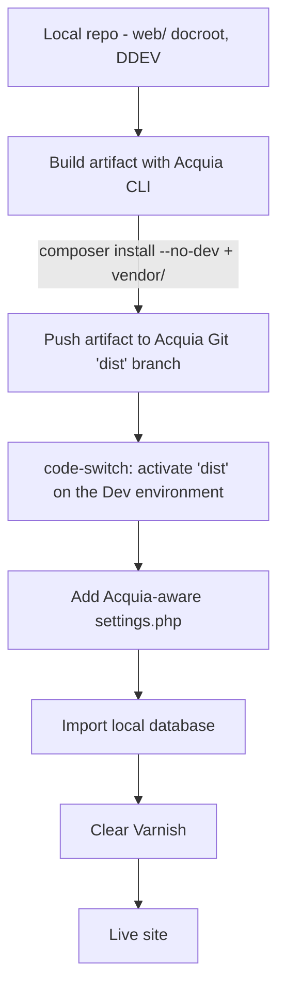
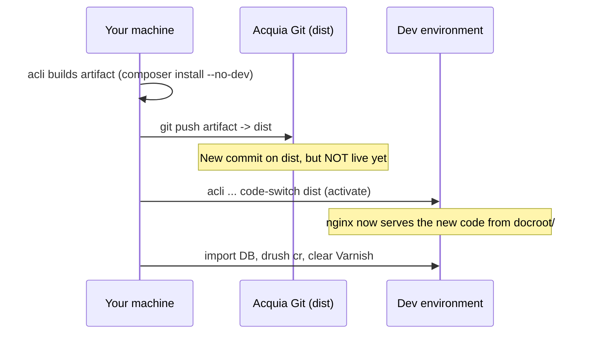

# Deploying a Composer-managed Drupal site to Acquia Cloud

> **Dev note / runbook.** A step-by-step account of how this project (Drupal 11,
> Composer-managed, developed locally with DDEV) was first deployed to an
> **Acquia Cloud Next** environment — including every issue we hit and how we
> fixed it. Written so a teammate can reproduce it (or debug the next one)
> without rediscovering the same traps.

---

## TL;DR



The non-obvious parts (each cost us a debugging cycle):

| Gotcha | One-line fix |
|---|---|
| Acquia only accepts **RSA** SSH keys | `ssh-keygen -t rsa -b 4096` (not ed25519) |
| Acquia doesn't run `composer install` on deploy | Build an **artifact** (`acli push:artifact`) that bundles `vendor/` |
| Host PHP too old / OOM during build | Build under PHP 8.5, `php -d memory_limit=-1`, pin `config.platform.php` |
| Pushing to Git ≠ deploying | Run a **code-switch** to activate the branch on the environment |
| `settings.php` was gitignored | Un-ignore it so it ships in the artifact |
| Acquia serves from `docroot/`, project used `web/` | Relocate the Composer web root to `docroot/` |
| Old 404s "stuck" after fixing | **Clear Varnish** |

---

## 0. Concepts you must understand first

**Acquia Cloud is not a "git push and it runs" host.** Two facts drive everything:

1. **It serves exactly what is committed to the branch.** There is no
   `composer install` step on deploy. So your dependencies (`vendor/`, Drupal
   `core`, contrib modules) must physically be *in the branch you deploy*. Since
   those are normally gitignored, you build a **deployment artifact**: a
   throwaway commit that contains the source **plus** the installed
   dependencies. The Acquia CLI (`acli`) does this for you.

2. **The document root is fixed.** Each environment exposes
   `DOCROOT=/var/www/html/docroot`. The web server serves `docroot/index.php`.
   The popular Drupal `recommended-project` template uses `web/` as its docroot —
   which does **not** match. You either reconfigure or (what we did) relocate to
   `docroot/`.

```
Local (DDEV)                     Acquia Cloud Next
------------                     -----------------
repo/                            /var/www/html/           <- artifact checkout
  docroot/       <- web root       docroot/     <- DOCROOT, served by nginx
    index.php                        index.php
  vendor/        <- gitignored     vendor/       <- bundled INTO the artifact
  config/sync/                     config/sync/
  composer.json                    composer.json
```

**Deployment flow at a glance:**



---

## 1. Prerequisites & tools

| Tool | Role | Install |
|---|---|---|
| **Acquia CLI (`acli`)** | Build/push artifacts, call the Cloud API, deploy | PHAR: download `acli.phar` from GitHub releases → `/usr/local/bin/acli` |
| **Composer** (host) | `acli` shells out to it to build the artifact | `brew install composer` |
| **Git** | Push artifacts, manage the repo | — |
| **DDEV** | Local development environment | — |
| An **Acquia Cloud account** | With access (team member) to the target application | — |

> ⚠️ **Composer must run under a PHP that can *parse* your dependencies.** Drupal 11
> contrib code (e.g. `drupal/core-recipe-unpack`) uses **PHP 8.3 syntax** (typed
> class constants). Composer *loads its plugins at runtime*, so a host PHP older
> than 8.3 will fatal with a `ParseError` before it does anything useful.

---

## 2. Step-by-step

### Step 1 — SSH key (must be RSA)

Acquia's Git and SSH endpoints **reject ed25519 keys**:

```
The supplied public key type is unsupported: it must be RSA (ssh-rsa).
```

Generate a dedicated RSA key and register the **public** half in the Acquia
Cloud UI (*Profile → SSH keys → Add SSH key*):

```bash
ssh-keygen -t rsa -b 4096 -C "you@example.com (acquia)" -f ~/.ssh/acquia_key -N ""
cat ~/.ssh/acquia_key.pub | pbcopy   # paste into Acquia UI
```

**`~/.ssh/config`** — point Acquia hosts at this key. Note the two domains
(`*.hosting.acquia.com` = Git, `*.acquia-sites.com` = per-environment SSH). If
you use a 1Password / agent-based `Host *` block, you must override it here or
the agent (which has no matching key) answers first → `Permission denied`:

```ssh-config
Host *.hosting.acquia.com *.acquia-sites.com
  AddKeysToAgent yes
  UseKeychain yes
  IdentityFile ~/.ssh/acquia_key
  IdentitiesOnly yes
  IdentityAgent none          # bypass any agent from a later "Host *" block

Host *
  IdentityAgent "…1password…agent.sock"
```

> This block must come **before** any `Host *` block — SSH takes the first value
> it finds per option.

Verify (allow ~1–10 min for the key to propagate on Acquia's side):

```bash
ssh -T pp9187eff2@svn-45062.prod.hosting.acquia.com   # "Welcome to Acquia Cloud" = success
```

**Debugging tip:** `ssh -vT <host>` shows which key is *offered*. If the right
key is offered but still denied, the problem is on Acquia's side (propagation
delay or key on the wrong account), not your config.

### Step 2 — Authenticate `acli` & discover the environment

```bash
acli auth:login                    # uses a Cloud API token (Account → API tokens)
acli api:accounts:find             # confirm you're the right user
acli api:applications:environment-list <APP_UUID>
```

Record the values you'll reuse (ours shown as an example):

```
Application UUID : 9187eff2-bfe1-4bd4-a4e4-08ea2a634894
Environment ID   : 187253-9187eff2-bfe1-4bd4-a4e4-08ea2a634894   (Dev)
Deploy branch    : dist            (from env vcs.path)
Git remote       : pp9187eff2@svn-45062.prod.hosting.acquia.com:pp9187eff2.git
Env SSH          : pp9187eff2.dev@pp9187eff2dev.ssh.prod.acquia-sites.com
Public URL       : http://pp9187eff2dev.prod.acquia-sites.com
```

### Step 3 — Make the build reproducible (PHP platform pin)

Because the artifact is built on your machine, pin the PHP version Composer
resolves against so it matches Acquia's runtime (8.3), independent of your host
PHP:

```jsonc
// composer.json
"config": {
    "platform": { "php": "8.3.0" },
    "allow-plugins": { /* … */ }
}
```

Refresh the lock hash (do this where you *have* PHP 8.3 — inside DDEV):

```bash
ddev composer update --lock --no-install
```

### Step 4 — Add an Acquia-aware `settings.php` (and don't gitignore it)

`sites/default/` is read-only on Acquia and `settings.php` must arrive **in the
artifact**. Acquia injects the DB credentials via a generated include; load it:

```php
// docroot/sites/default/settings.php

// Acquia Cloud (DB creds, hash salt) — only present on Acquia.
if (file_exists('/var/www/site-php') && isset($_ENV['AH_SITE_GROUP'])) {
  require '/var/www/site-php/' . $_ENV['AH_SITE_GROUP']
        . '/' . $_ENV['AH_SITE_GROUP'] . '-settings.inc';
}

// DDEV (local dev).
if (getenv('IS_DDEV_PROJECT') == 'true' && file_exists(__DIR__ . '/settings.ddev.php')) {
  include __DIR__ . '/settings.ddev.php';
}

$settings['config_sync_directory'] = '../config/sync';
```

The three environment blocks are **mutually exclusive** (Acquia vs DDEV vs
local), so one committed file serves every environment. It contains no
secrets — real credentials live in the includes.

> 🔑 **The gitignore trap.** `acli push:artifact` honors `.gitignore` when
> mirroring source into the artifact. A default Drupal `.gitignore` ignores
> `web/sites/*/settings.php`, so even a *committed* `settings.php` gets filtered
> out of the artifact. **Remove that ignore line** (keep `settings.local.php`,
> `settings.ddev.php`, `services.yml` ignored):
>
> ```diff
> - /docroot/sites/*/settings.php
>   /docroot/sites/*/settings.local.php
>   /docroot/sites/*/settings.ddev.php
> ```

### Step 5 — Match the document root (`web/` → `docroot/`)

Acquia serves `DOCROOT=/var/www/html/docroot`. If your project uses `web/`, the
site 200s to Acquia's *placeholder* page ("Welcome to Acquia Cloud") and every
Drupal path 404s. Relocate the web root:

```bash
# 1. Composer config
#    web-root: "web/" -> "docroot/"
#    installer-paths: "web/…" -> "docroot/…"
# 2. Move the tree
git mv web docroot
# 3. Update .gitignore (web/ -> docroot/), .ddev/config.yaml (docroot: docroot),
#    and CI paths (phpcs/phpstan docroot/modules/custom …)
# 4. Reconcile
ddev composer install          # re-scaffolds & places core/contrib under docroot/
ddev composer update --lock --no-install
```

> **How to know your target docroot:** SSH into the env and run `echo $DOCROOT`,
> or check `ls /var/www/html/` — Acquia auto-mounts `files`/`sites` into the real
> docroot, so that's the folder it serves from.

### Step 6 — Build & push the artifact

`acli` requires a **clean working tree** (`git stash` or commit first) and a
`docroot/` that looks like a Drupal app. Build under PHP 8.5 with memory
unlocked (see issues #2/#3 below):

```bash
PATH="/opt/homebrew/opt/php/bin:$PATH" \
  php -d memory_limit=-1 /usr/local/bin/acli push:artifact \
    <ENV_ID> \
    --destination-git-branch=dist \
    -u pp9187eff2@svn-45062.prod.hosting.acquia.com:pp9187eff2.git \
    --no-interaction
```

What it does: clones `dist` → compiles the project into a temp dir
(`composer install --no-dev`) → copies in `vendor/` etc. → sanitizes → commits →
pushes to `dist`. Success looks like:

```
73599c100..ca45689f1  dist -> dist    ✔ Pushing changes to dist branch.
```

### Step 7 — Deploy (activate) the pushed code

**Pushing updates Git; it does not make the code live.** Trigger a code switch:

```bash
acli api:environments:code-switch <ENV_ID> dist
# → returns a notification UUID; poll it until "completed":
acli api:notifications:find <NOTIFICATION_UUID> | grep -E '"status"|"label"'
```

### Step 8 — Get a database

We imported the local DDEV database (option chosen: bring real content over).
Export locally, drop the remote tables, pipe the dump into the environment's
`drush`:

```bash
# Export local DB
ddev export-db --file=/tmp/local-db.sql.gz

# Import into Acquia Dev
ssh <ENV_SSH> 'cd /var/www/html && vendor/bin/drush sql:drop -y'
gunzip -c /tmp/local-db.sql.gz | ssh <ENV_SSH> 'cd /var/www/html && vendor/bin/drush sql:cli'

# Finalize
ssh <ENV_SSH> 'cd /var/www/html && vendor/bin/drush updatedb -y && vendor/bin/drush cr'
```

> Alternative: `drush site:install --existing-config` for a fresh, content-free
> site built from `config/sync` (194 exported YAML files in our case).

### Step 9 — Clear Varnish

Acquia fronts the site with Varnish. Any 404s/placeholder pages served *while it
was broken* get cached (we saw `X-Cache: HIT, Age: 991` on a stale 404). Purge:

```bash
acli api:environments:domains-clear-varnish <ENV_ID> pp9187eff2dev.prod.acquia-sites.com
```

### Step 10 — Verify

```bash
curl -sS -o /dev/null -w "%{http_code}\n" http://pp9187eff2dev.prod.acquia-sites.com/           # 200
curl -sS -o /dev/null -w "%{http_code}\n" http://pp9187eff2dev.prod.acquia-sites.com/user/login # 200
```

Inspect cache behavior with `curl -I` and watch `X-Cache` (`MISS` = fresh from
Drupal, `HIT` = from Varnish) and `Age`.

---

## 3. Issues we hit → root cause → fix

| # | Symptom | Root cause | Fix |
|---|---|---|---|
| 1 | `public key ... must be RSA` | Acquia rejects ed25519 | Generate `ssh-keygen -t rsa -b 4096` |
| 2 | `Permission denied (publickey)` even with key added | `Host *` 1Password agent answered first; env SSH domain (`*.acquia-sites.com`) not covered | Dedicated `Host` block with `IdentityAgent none`, both domains |
| 3 | `ParseError: unexpected identifier "RECIPE_PACKAGE_TYPE"` | Host PHP 8.2 can't parse 8.3-syntax Composer plugin | Build under PHP 8.5 (`PATH=/opt/homebrew/opt/php/bin:$PATH`) |
| 4 | `Allowed memory size … exhausted` (RecursiveDirectoryIterator) | Default `memory_limit=128M` too small for a full Drupal + `vendor/` scan | `php -d memory_limit=-1 acli …` |
| 5 | `The required binary "composer" does not exist` | Project only had `ddev composer`; no host Composer | `brew install composer` |
| 6 | `local Git repository has uncommitted changes` | `acli` demands a clean tree | Commit or `git stash --include-untracked` |
| 7 | Homepage 200 = "Welcome to Acquia Cloud", all paths 404 | Acquia serves `docroot/`; app was in `web/` | Relocate web root `web/` → `docroot/` |
| 8 | `settings.php` missing on server after deploy | `acli` honors `.gitignore`; `settings.php` was ignored | Un-ignore `settings.php` |
| 9 | Pushed to `dist` but site unchanged | Push ≠ deploy | `acli api:environments:code-switch <env> dist` |
| 10 | `/user/login` still 404 after everything worked | Stale Varnish cache of the earlier broken 404 | Clear Varnish for the domain |

---

## 4. Key learnings

- **Artifact, not source.** Anything gitignored (dependencies **and** things like
  `settings.php`) is invisible to Acquia unless it's in the artifact. Know what
  `acli push:artifact` includes and excludes.
- **Two-phase deploy.** `push:artifact` (updates Git) and `code-switch`
  (activates it) are separate. Automate both or you'll stare at "unchanged" sites.
- **Build host PHP matters twice** — it must *parse* your plugins (≥ the syntax
  level your deps use) and you should *pin* the resolution target
  (`config.platform.php`) to the Cloud runtime.
- **Docroot is the platform's decision, not your framework's.** Confirm
  `$DOCROOT` on the server early; align the repo to it.
- **When something "should work but doesn't," check Varnish** before re-deploying.
  `curl -I` + `X-Cache`/`Age` tells you instantly if you're fighting a cache.
- **`acli` needs a clean tree and a Drupal-shaped `docroot/`.** Sequencing your
  commits/stashes matters.

---

## 5. Command cheat-sheet

```bash
# --- one-time setup ---
ssh-keygen -t rsa -b 4096 -f ~/.ssh/acquia_key -N ""    # register .pub in Acquia UI
brew install composer
acli auth:login

# --- discover ---
acli api:applications:environment-list <APP_UUID>
acli api:environments:find <ENV_ID>

# --- deploy (repeat per release) ---
PATH="/opt/homebrew/opt/php/bin:$PATH" php -d memory_limit=-1 \
  /usr/local/bin/acli push:artifact <ENV_ID> \
  --destination-git-branch=dist -u <GIT_URL> --no-interaction
acli api:environments:code-switch <ENV_ID> dist
acli api:notifications:find <NOTIF_UUID>            # poll to "completed"

# --- database ---
ddev export-db --file=/tmp/db.sql.gz
ssh <ENV_SSH> 'cd /var/www/html && vendor/bin/drush sql:drop -y'
gunzip -c /tmp/db.sql.gz | ssh <ENV_SSH> 'cd /var/www/html && vendor/bin/drush sql:cli'
ssh <ENV_SSH> 'cd /var/www/html && vendor/bin/drush updatedb -y && vendor/bin/drush cr'

# --- caches / verify ---
acli api:environments:domains-clear-varnish <ENV_ID> <DOMAIN>
curl -sSI http://<DOMAIN>/user/login | grep -iE 'HTTP/|x-cache|age'

# --- remote drush over SSH (handy for debugging) ---
ssh <ENV_SSH> 'cd /var/www/html && vendor/bin/drush status'
```

---

*Environment specifics in this guide (UUIDs, subscription `pp9187eff2`, domain)
are for this project's Dev environment — substitute your own. None are secrets;
real credentials are injected by Acquia at runtime and never committed.*
