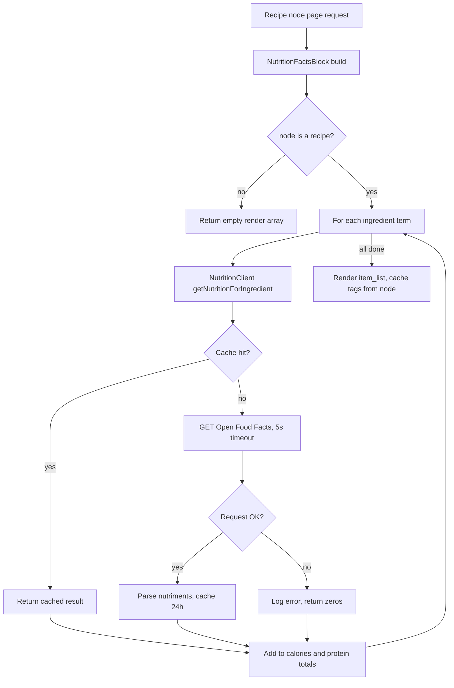

# Build Outcomes — Day 4 (Site Studio) & Day 5 (API Integration)

> Branch: `chore/export-site-config` · Last updated: 2026-07-08
>
> What actually got built when the Day 4–5 labs met the running project. This is the **outcome** companion to the plan — it does not re-teach the concepts or repeat the code comments already in [`../objectives/`](../objectives/); it records what shipped, what diverged, and why. Read the objective first, then this. For deployment/config/theming gotchas see the sibling [`lessons-learned.md`](lessons-learned.md); this file is scoped to the module + Site Studio build.

---

## Objective → outcome map

| Objective | What shipped | Status |
|---|---|---|
| [Day 5 §1.3](../objectives/day5-integrations-identity-interview.md) — service calls the real API | [`NutritionClient::getNutritionForIngredient()`](../../docroot/modules/custom/flavorful_nutrition/src/NutritionClient.php) now calls Open Food Facts with a 5s timeout, try/catch + logging, and a 24h `cache.default` entry. `@cache.default` injected via [`flavorful_nutrition.services.yml`](../../docroot/modules/custom/flavorful_nutrition/flavorful_nutrition.services.yml). | Done — matches the lab verbatim |
| [Day 5 §1.4](../objectives/day5-integrations-identity-interview.md) — block maps API → current recipe | [`NutritionFactsBlock`](../../docroot/modules/custom/flavorful_nutrition/src/Plugin/Block/NutritionFactsBlock.php) injects `current_route_match`, reads the node off the route, sums nutrition across `field_ingredients`, and caches on the node's tags (replacing Day 2's `max-age: 0`). | Done — behaviour matches; see deviations for two nits |
| [Day 5 §2](../objectives/day5-integrations-identity-interview.md) — Chef-as-User + OpenID Connect | Not in this changeset. | Not attempted (softer JD requirement; read-and-rehearse) |
| [Day 4 Part 0A](../objectives/day4-site-studio.md) — install & connect Site Studio | `acquia/cohesion` + `acquia/cohesion-theme` (`^8.2`) added to [`composer.json`](../../composer.json) and resolved into `docroot/modules/contrib/cohesion`. `cweagans/composer-patches` allowed as a plugin (Cohesion pulls it in). | Partial — installed, not initialised (see deviations) |
| [Day 4 Parts 1–4](../objectives/day4-site-studio.md) — build the Recipe Card component | Not in this changeset — blocked behind account-key init. | Blocked on Site Studio init |

---

## Flowchart

Runtime path of the shipped nutrition block. The `For each ingredient term` node loops (the `L → D` edge), and control returns early if the page is not a recipe.



---

## Deltas-only walkthrough

Only what changed against the objective's Day 2 baseline — the concepts and the full listings live in [Day 2](../objectives/day2-module-and-twig.md) and [Day 5](../objectives/day5-integrations-identity-interview.md).

**1. A third dependency, injected** — `services.yml` gains `@cache.default` so the client can cache; nothing else about the service registration changed.

```yaml
arguments: ["@http_client", "@logger.factory", "@cache.default"]
```

**2. Cache-first read in the client** — the stub `return [...42, 3]` is gone. The method now keys on a hashed ingredient name and short-circuits on a hit before any network call.

```php
$cid = 'flavorful_nutrition:' . md5(strtolower($ingredient));
if ($hit = $this->cache->get($cid)) {
  return $hit->data;                       // served from cache
}
```

**3. The real call + graceful failure** — Guzzle with an explicit `timeout`, a descriptive `User-Agent` (Open Food Facts asks for one), a 24h `cache->set`, and a `try/catch` that logs and falls back to zeros so a slow API never breaks the page.

```php
$this->cache->set($cid, $result, time() + 86400);
// ...
catch (\Throwable $e) {
  $this->loggerFactory->get('flavorful_nutrition')->error('Nutrition API: @m', ['@m' => $e->getMessage()]);
}
```

**4. Block becomes node-aware** — the new `current_route_match` dependency lets `build()` bail on non-recipe pages, then aggregate across the recipe's ingredient references instead of the hard-coded `'tomato'`.

```php
$node = $this->routeMatch->getParameter('node');
if (!$node instanceof \Drupal\node\NodeInterface || $node->bundle() !== 'recipe') {
  return [];
}
foreach ($node->get('field_ingredients')->referencedEntities() as $term) {
  $n = $this->client->getNutritionForIngredient($term->label());
  // sum $n['calories'] / $n['protein']
}
```

**5. Correct cacheability** — the render array swaps `'#cache' => ['max-age' => 0]` for the node's cache tags, so the block is cached and only rebuilds when that recipe is edited.

```php
'#cache' => ['tags' => $node->getCacheTags()],
```

---

## Deviation log

Where the build departed from the plan, and why. Format matches [`lessons-learned.md`](lessons-learned.md): what happened → why → what we did.

| # | Divergence from objective | Why it happened | What we did / open item |
|---|---|---|---|
| 1 | **Site Studio installed but not connected.** Day 4 §0A ends with `cohesion:import` + `cohesion:rebuild` against valid keys; we stopped after Composer resolved the packages. | Site Studio needs an Acquia **API key + agency key** to initialise, which the project doesn't have yet. The objective flagged this as the highest-risk area and offered the [no-licence path (§0B)](../objectives/day4-site-studio.md). | Packages are in the tree so the vocabulary/story is real, but no component was built. Either obtain keys and run the import/rebuild pair, or fall back to §0B. Keep `sitestudio_claro` **disabled** — it fatals on Drupal 11 (missing `claro.theme`). |
| 2 | **Nutrition is product-level, not ingredient-level.** Totals are an approximation, surfaced as "Estimated nutrition". | Open Food Facts search returns the first matching *product* per ingredient term (`page_size=1`), and values are per-100g — not a true per-recipe calculation. The objective already frames this as "rough per-100g". | Accepted for a learning build; the honest label ("Estimated") is the outcome. A real feature would need quantities/units and a nutrition-specific dataset. |
| 3 | **Coding-standards violations, fixed at PR time.** `phpcs --standard=Drupal,DrupalPractice` flagged a `\Drupal\node\NodeInterface` referenced inline instead of via a `use` statement, a missing class doc comment on `NutritionClient`, and an inline comment placed after a statement. | The classes were hand-edited against the lab snippets; `phpcs` wasn't run before the first commit. | Added the `use` statement + short reference, restored the class doc comment, and moved the comment onto its own line. Verified clean with `ddev exec vendor/bin/phpcs --standard=Drupal,DrupalPractice docroot/modules/custom docroot/themes/custom`. |

---

*Add to this file whenever a later day's build lands so the objectives and outcomes stay in step — the plan says what we intended, this says what reality returned.*
