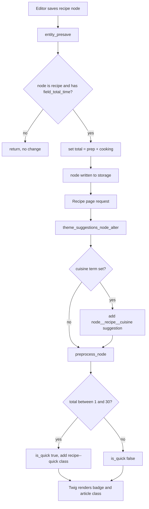

# Build Outcomes — Day 6 (Hooks & Preprocess)

> Branch: `feat/nutrition-api-and-vetting-docs` · Last updated: 2026-07-09
>
> What actually got built when the [Day 6 lab](../objectives/day6-hooks-preprocess.md) met the running project. This is the **outcome** companion to the plan — it does not re-teach the hook system or repeat the code comments already in the objective; it records what shipped, what diverged, and why. Read [Day 6](../objectives/day6-hooks-preprocess.md) first, then this. Sits alongside the [Day 4–5 outcomes](day4-5-build-outcomes.md) and the cross-cutting [`lessons-learned.md`](lessons-learned.md).

---

## Objective → outcome map

| Objective | What shipped | Status |
|---|---|---|
| [§1](../objectives/day6-hooks-preprocess.md) — create the `.module` hook file | [`flavourful_nutrition.module`](../../docroot/modules/custom/flavourful_nutrition/flavourful_nutrition.module) holds all four procedural hooks. | Done — module is British-spelled `flavourful_nutrition` (see deviations) |
| [§2](../objectives/day6-hooks-preprocess.md) — `hook_form_FORM_ID_alter` on the recipe form | `flavourful_nutrition_form_node_recipe_form_alter()` adds help text to the cooking-time field and lifts the summary to the top. | Done — retargeted to real field names |
| [§3](../objectives/day6-hooks-preprocess.md) — `hook_entity_presave` stores `field_total_time` | `flavourful_nutrition_entity_presave()` narrows to recipe nodes and sets `field_total_time = field_prep_time + field_cooking_time`, with fieldable/`hasField` guards. | Done — but the two fields had to be created first (see deviations) |
| [§4](../objectives/day6-hooks-preprocess.md) — preprocess adds `is_quick` + `recipe--quick` class | `flavourful_nutrition_preprocess_node()` sets `is_quick` (≤30 min) and appends the class; [`node--recipe.html.twig`](../../docroot/themes/custom/flavourful/templates/content/node--recipe.html.twig) prints the badge. | Done |
| [§5](../objectives/day6-hooks-preprocess.md) — `hook_theme_suggestions_node_alter` per cuisine | `flavourful_nutrition_theme_suggestions_node_alter()` adds `node__recipe__<cuisine>`; [`node--recipe--italian.html.twig`](../../docroot/themes/custom/flavourful/templates/content/node--recipe--italian.html.twig) created. | Partial — suggestion works, template is an unmodified copy |
| [§6](../objectives/day6-hooks-preprocess.md) — rewrite preprocess as a `#[Hook]` class | [`RecipeHooks.php`](../../docroot/themes/custom/flavourful/src/Hook/RecipeHooks.php) written, but under the **theme** with the **module** namespace, and the procedural version was left in place. | Deviated — the swap did not actually happen (see deviations) |
| [§7](../objectives/day6-hooks-preprocess.md) — `hook_update_N` backfill | Not implemented. | Not attempted — §7 is flagged "awareness" only |

Supporting change: Twig debug (`debug`/`auto_reload`/`cache:false`) enabled in [`development.services.yml`](../../docroot/sites/development.services.yml) so the §5 suggestion comments are visible in page source.

---

## Flowchart

Which hook fires when a recipe is saved and then rendered — the two lifecycle points Day 6 plugs into.



---

## Deltas-only walkthrough

Only what changed against the objective's baseline — concepts and full listings live in [Day 6](../objectives/day6-hooks-preprocess.md).

**1. Two new integer fields, added via config** — the objective assumed `field_prep_time` already existed and only had you add `field_total_time`. The recipe bundle actually shipped just `field_cooking_time`, so **both** fields were created: [`field.storage.node.field_prep_time.yml`](../../config/sync/field.storage.node.field_prep_time.yml) / [`field.field.node.recipe.field_prep_time.yml`](../../config/sync/field.field.node.recipe.field_prep_time.yml) and the matching `field_total_time` pair, each `min: 0` with a `' min'` suffix. `field_total_time` is hidden on the form display (auto-filled).

**2. Real field machine names in every hook** — the lab's `field_cook_time` / `field_cuisine` don't exist here; the hooks target `field_cooking_time` and `field_recipe_cuisine_type`.

```php
// form alter — real field name, TranslatableMarkup instead of t()
$form['field_cooking_time']['widget'][0]['value']['#description'] =
  new TranslatableMarkup('Active cooking time in minutes (excludes prep).');
$form['field_summary']['#weight'] = -100;   // lab used -10
```

**3. Presave hardened past the snippet** — beyond the `node`/`recipe` narrowing, it bails on non-fieldable entities and `hasField()`-guards each read/write, because the destination field is new and may be absent on older exports.

```php
if (!$entity instanceof FieldableEntityInterface) { return; }
if ($entity->getEntityTypeId() !== 'node' || $entity->bundle() !== 'recipe') { return; }
if (!$entity->hasField('field_total_time')) { return; }
$prep = $entity->hasField('field_prep_time') ? (int) $entity->get('field_prep_time')->value : 0;
$cook = $entity->hasField('field_cooking_time') ? (int) $entity->get('field_cooking_time')->value : 0;
$entity->set('field_total_time', $prep + $cook);
```

**4. Cuisine suggestion uses the real reference field** — `field_recipe_cuisine_type` in place of `field_cuisine`; the `node__recipe__<machine>` mapping is otherwise verbatim.

**5. `#[Hook]` class present but not wired in** — [`RecipeHooks.php`](../../docroot/themes/custom/flavourful/src/Hook/RecipeHooks.php) mirrors the §6 body, but the procedural `flavourful_nutrition_preprocess_node()` was **not** deleted. See deviation 5 for why the intended swap is a no-op.

---

## Deviation log

Where the build departed from the plan, and why. Format matches [`lessons-learned.md`](lessons-learned.md): what happened → why → what we did.

| # | Divergence from objective | Why it happened | What we did / open item |
|---|---|---|---|
| 1 | **British spelling throughout.** Module is `flavourful_nutrition` and theme is `flavourful`; the objective says `flavorful`. | The [branding rename](../../docroot/themes/custom/flavourful/) (commit `7c47b17`) standardised on "Flavourful" after the lab was written. | Hooks are prefixed `flavourful_nutrition_*`; treat every `flavorful_*` symbol in the objective as its `flavourful_*` equivalent. |
| 2 | **Field machine names differ.** Hooks use `field_cooking_time` and `field_recipe_cuisine_type`, not the lab's `field_cook_time` / `field_cuisine`. | Those are the names the recipe bundle was actually built with on earlier days. | Retargeted the form alter, presave, and suggestion hooks to the real fields. No behavioural change. |
| 3 | **`field_prep_time` had to be created too.** §3 only adds `field_total_time` and assumes prep already exists — it didn't. | The bundle shipped a single `field_cooking_time`; there was no separate prep field to sum. | Added both `field_prep_time` and `field_total_time` as integer fields (config exported), `min: 0`, `' min'` suffix. Prep is editable, total is form-hidden. |
| 4 | **`field_total_time` (and prep) left visible on the full view display.** §3 says hide total again after testing. | The fields were added to the view display to verify the presave math in the UI and not reverted. | Left visible (inline) for now — harmless, and it doubles as a sanity check that presave ran. Open item: hide `field_total_time` on the view display if it shouldn't show to visitors. |
| 5 | **§6 OOP conversion is a no-op — procedural still runs.** `RecipeHooks.php` lives at `themes/custom/flavourful/src/Hook/` but is namespaced `Drupal\flavorful_nutrition\Hook`, and the procedural `flavourful_nutrition_preprocess_node()` was never deleted. | The file was dropped into the theme rather than the module, kept the old-spelling module namespace, and the "then delete the procedural version" step was skipped. As placed it is discoverable as neither a module hook (wrong path) nor a theme hook (wrong namespace; theme OOP hooks also need D11.3+). | Preprocess works — but via the **procedural** hook, not the `#[Hook]` class. Open item: to make the swap real, move the class to `modules/custom/flavourful_nutrition/src/Hook/`, fix the namespace to `Drupal\flavourful_nutrition\Hook`, and delete the procedural function. |
| 6 | **Italian template is an unmodified copy.** `node--recipe--italian.html.twig` is byte-for-byte identical to `node--recipe.html.twig`. | Created to prove the suggestion resolves (it shows in the Twig-debug comments), but no cuisine-specific markup was added yet. | Suggestion mechanism is demonstrated; the template has no distinguishing content. Open item: add Italian-specific markup, or the extra file earns its keep only as a debug demo. |
| 7 | **`hook_update_N` backfill not written.** §7's `flavourful_nutrition_update_10001()` doesn't exist. | §7 is explicitly framed as awareness, not a build step. | Existing recipes get `field_total_time` on their next save (presave). If a bulk backfill is ever needed, add the update hook and run `drush updb`. |

---

## Update — 2026-07-13 (rename cascade, OOP swap, backfill)

> A later session resolved several open items above and surfaced two failures the 2026-07-09 tables predate. This block is additive — the tables above stay the record of the initial build; read them first. The REST-export follow-on is in [`day7-build-outcomes.md`](day7-build-outcomes.md).

### Open items now resolved

| Original | What changed | Status now |
|---|---|---|
| Deviation 5 — §6 `#[Hook]` swap was a no-op | `RecipeHooks.php` namespace corrected `Drupal\flavorful_nutrition\Hook` → `Drupal\flavourful\Hook` (commit `8185640`); it is now discovered and run as a **theme** OOP hook. The wrong namespace had also made the file load twice, throwing a `Cannot declare class … already in use` fatal on `drush en eva`. | Partially resolved — the class works, but the procedural `flavourful_nutrition_preprocess_node()` was not deleted, so both now run (see new deviation 10). |
| Supporting change — "Twig debug enabled" | `development.services.yml` in fact had **no** `twig.config` block, so debug was silently off despite the note. Added `debug` / `auto_reload` / `cache: false`. | Resolved — the §5 suggestion comments now actually render in page source. |
| Deviation 7 — no backfill | Backfilled all 21 recipes with a one-off re-save (preserving `changed`, no new revision) rather than a `hook_update_N`. | Resolved pragmatically — the update hook still doesn't exist; the data is fixed. |
| — (CI) | `RecipeHooks.php` carried three `Drupal,DrupalPractice` violations (brace placement, trailing blank line); fixed with `phpcbf` and shipped with the namespace fix (`8185640`). | Resolved — phpcs exits 0 across custom modules and themes. |

### New deviations (not in the 2026-07-09 tables)

| # | What happened | Cause | What we did / open item |
|---|---|---|---|
| 8 | **Site would not bootstrap** — every `drush` and web request threw `AssertionError: flavorful_nutrition.info.yml does not exist`. | Active config was already fully on `flavourful_nutrition`, but the compiled DI **container cache** still referenced the pre-rename module; the rename never cleared it. | Truncated `cache_container` / `cache_bootstrap` / `cache_discovery` / `cache_default` / `cache_config` directly (bootstrap-independent). Boot restored — no file or DB rename was needed. |
| 9 | **Preprocess hook silently never fired** — the `is_quick` badge showed for no recipe. | The function was `flavorful_nutrition_preprocess_node()` (old spelling); Drupal only invokes preprocess hooks whose prefix matches the module machine name `flavourful_nutrition`. | Renamed to `flavourful_nutrition_preprocess_node()` + `drush cr`. A concrete instance of deviation 1 — `grep -rn 'flavorful' docroot/{modules,themes}/custom` is the cheap guard, since these fail only at runtime. |
| 10 | **Duplicate preprocess logic** — after fixing deviation 5, both `RecipeHooks::preprocessNode()` (theme OOP) and `flavourful_nutrition_preprocess_node()` (module procedural) set `is_quick` / `recipe--quick`. | The §6 conversion added the OOP class without removing the procedural one. | Harmless today (the rendered class de-duplicates) but they will drift. Open item: keep one — recommended the OOP class, delete the procedural block. |

Deviations 8–10, plus deviation 5's fatal, all trace to the single `flavorful` → `flavourful` rename (commit `7c47b17`) landing across module name, theme name, namespace, hook prefix, and the container cache. Every one is a runtime-only failure — none is caught by phpcs or the compiled container until the code path executes.

---

*Add to this file — or a new `dayN-build-outcomes.md` — whenever a later day lands, so the objectives and outcomes stay in step.*
