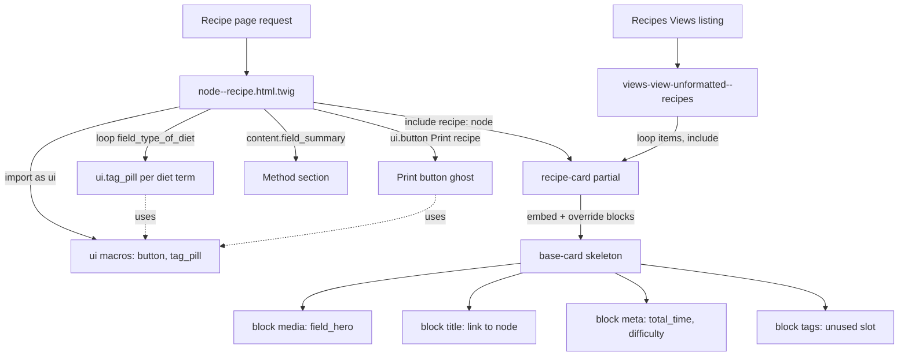

# Build Outcomes — Day 8 (Twig Best Practices)

> Branch: `feat/day7-views-config-and-full-export` · Last updated: 2026-07-13
>
> What actually got built when the [Day 8 lab](../objectives/day8-twig-best-practices.md) met the running project. This is the **outcome** companion to the plan — it does not re-teach `include` vs `embed` vs `extends` vs `macro` or repeat the snippets already in the objective; it records what shipped, what diverged, and why. Read [Day 8](../objectives/day8-twig-best-practices.md) first, then this. Sits alongside the [Day 6 outcomes](day6-build-outcomes.md) and the cross-cutting [`lessons-learned.md`](lessons-learned.md).
>
> **Status: work-in-progress.** These changes are uncommitted (nothing staged) and still carry debug scaffolding. Open items are called out in the deviation log — treat this doc as a checkpoint, not a finished slice.

---

## Objective → outcome map

| Objective | What shipped | Status |
|---|---|---|
| [§1](../objectives/day8-twig-best-practices.md) — base card others `extends`/`embed` | [`partials/base-card.html.twig`](../../docroot/themes/custom/flavourful/templates/partials/base-card.html.twig) — a `card` skeleton with empty `media`/`title`/`meta`/`tags` blocks. | Done |
| [§2](../objectives/day8-twig-best-practices.md) — recipe-card partial you `include` | [`partials/recipe-card.html.twig`](../../docroot/themes/custom/flavourful/templates/partials/recipe-card.html.twig) — `embed`s the base card, overrides `media`/`title`/`meta`. | Done — but embeds via the wrong namespace form (see deviation 1) and passes `recipe` through `only` (see deviation 2) |
| [§3](../objectives/day8-twig-best-practices.md) — macro file of UI atoms | [`macros/ui.html.twig`](../../docroot/themes/custom/flavourful/templates/macros/ui.html.twig) — `button(text, url, variant)` and `tag_pill(label)`. | Done — verbatim from the lab |
| [§4](../objectives/day8-twig-best-practices.md) — reuse the card in a listing | [`views/views-view-unformatted--recipes.html.twig`](../../docroot/themes/custom/flavourful/templates/views/views-view-unformatted--recipes.html.twig) — `recipe-grid` loop that `include`s the recipe card per row. | Partial — the row variable is `rows`, not `recipes`; this template as written iterates nothing (see deviation 3) |
| [§5](../objectives/day8-twig-best-practices.md) — refactor Day-2 `node--recipe` to compose | [`content/node--recipe.html.twig`](../../docroot/themes/custom/flavourful/templates/content/node--recipe.html.twig) — imports `ui`, includes the recipe card, loops diet terms into `tag_pill`, renders the summary as "Method", adds a `ui.button` print action. | Partial — composition landed, but debug `dump()` calls remain and namespaces are wrong (see deviations 1, 4) |
| [§7](../objectives/day8-twig-best-practices.md) fix box — rename `flavourful_theme.theme` → `flavourful.theme` | Not done — the file is still [`flavourful_theme.theme`](../../docroot/themes/custom/flavourful/flavourful_theme.theme). | Not attempted (see deviation 5) |

Supporting change: `drupal/twig_tweak:^3.4` added to [`composer.json`](../../composer.json) (the `|view` filter the card partials rely on is a twig_tweak filter). The [Day 8 objective doc itself](../objectives/day8-twig-best-practices.md) was also edited to carry real repo paths and a "fix your current files" box — that is a **plan** edit, logged here only so the two folders stay in step.

---

## Flowchart

How the templates compose at render time — one card definition reused on the node page and the listing, filled by macros. Follows the [§1–§5](../objectives/day8-twig-best-practices.md) composition the lab describes.



---

## Deltas-only walkthrough

Only what changed against the objective's baseline — concepts and full listings live in [Day 8](../objectives/day8-twig-best-practices.md).

**1. `base-card` matches the lab; `recipe-card` embeds it and threads `recipe` through.** The base card is the lab's skeleton. The recipe card diverges in its `embed` line: it passes the node in *and* keeps `only`, which the lab's snippet did not.

```twig

  {{ recipe.field_hero|view }}
  <a href="{{ path('entity.node.canonical', { node: recipe.id }) }}">{{ recipe.label }}</a>
  {{ recipe.field_total_time.value }} min · {{ recipe.field_difficulty.value }}

```

Adding `recipe: recipe` is a **correctness fix**, not a whim: `only` isolates the embedded scope, so without explicitly passing `recipe` the block overrides (which all read `recipe.*`) would render blank. Field names are the real bundle's — `field_hero`, `field_total_time`, `field_difficulty` — not the lab's `field_hero_image`/`field_total_time` placeholders.

**2. `ui.html.twig` is the lab's macros, unchanged.** `button(text, url, variant = 'primary')` and `tag_pill(label)` — no deltas worth annotating.

**3. `node--recipe` composes, but still carries debug scaffolding.** The refactor replaced the bare `<article{{attributes}}>` with the composed body:

```twig


{{dump(content)}}
{{dump(node)}}
{{dump(node.field_type_of_diet)}}

<article{{attributes.addClass('recipe-full')}}>
	
	<div class="recipe-full__tags">
		{{ ui.tag_pill(tag.entity.label) }}
	</div>
	<div class="recipe-full__method"><h2>{{ 'Method'|t }}</h2>{{ content.field_summary }}</div>
	{{ ui.button('Print recipe', '#', 'ghost') }}
```

The tag loop reads `node.field_type_of_diet` (real field) instead of the lab's `node.field_dietary`, and `tag.entity.label` dereferences the referenced term. The three `dump()` lines are live debugging left in place — see deviation 4.

**4. The Views row template loops the wrong variable.** The lab's example loops `recipes`; a Views `unformatted` row template exposes its rows as `rows`, so this file iterates an undefined `recipes` and emits an empty grid:

```twig
<div class="recipe-grid">
	
		
	
</div>
```

Note this file uses the **correct** `@flavourful/partials/…` namespace, while `node--recipe` and `recipe-card` use `@flavourful/templates/partials/…` — the two forms disagree (deviation 1).

---

## Deviation log

Where the build departed from the plan, and why. Format matches [`lessons-learned.md`](lessons-learned.md): what happened → why → what we did.

| # | Divergence from objective | Why it happened | What we did / open item |
|---|---|---|---|
| 1 | **Twig namespace is inconsistent and doubled.** `node--recipe` and `recipe-card` reference `@flavourful/templates/partials/…` and `@flavourful/templates/macros/…`; the Views template uses `@flavourful/partials/…`. | The default Drupal namespace `@flavourful` already maps to the theme's `templates/` dir, and no custom `components:` namespace is declared in [`flavourful.info.yml`](../../docroot/themes/custom/flavourful/flavourful.info.yml). So the `templates/` form resolves to `templates/templates/…`. | **Open item / likely bug:** drop the `templates/` segment everywhere — the objective's fix box already prescribes `@flavourful/partials/base-card.html.twig`. The Views template is the only file using the correct form. |
| 2 | **`recipe-card` embed passes `recipe` in addition to `attributes`.** The lab's snippet passes only `attributes` alongside `only`. | With `only` isolating scope, the block overrides read `recipe.*` and would render blank without it. | Kept — this is the correct fix. Documented so the divergence from the lab snippet is intentional, not accidental. |
| 3 | **Real field names throughout.** `field_hero` (not `field_hero_image`), `field_type_of_diet` (not `field_dietary`), plus `field_total_time`/`field_difficulty` in the card meta. | The lab used placeholder field names; the recipe bundle was built with these. | Retargeted to the real fields. `field_total_time` is the same field Day 6 introduced via presave. |
| 4 | **Debug `dump()` calls left in `node--recipe`.** Three `{{ dump(...) }}` lines print `content`, `node`, and `field_type_of_diet` at the top of the article. | Live debugging while wiring the tag loop; not yet removed. | **Open item:** delete the three `dump()` lines before commit. They require Twig debug/devel and dump the full render array into the page otherwise. |
| 5 | **Theme file still named `flavourful_theme.theme`.** The fix box's step 3 (rename to `flavourful.theme`) was not done. | The rename was deferred; the `is_quick` badge works via the module preprocess regardless, so it wasn't blocking. | **Open item:** rename `flavourful_theme.theme` → `flavourful.theme` so the theme's own preprocess is auto-loaded (Drupal only loads `{machine-name}.theme`). Carried over from the [Day 6 branding rename](day6-build-outcomes.md). |
| 6 | **`twig_tweak` added to composer but not in exported config.** `drupal/twig_tweak:^3.4` is in [`composer.json`](../../composer.json)/`composer.lock`, but `twig_tweak` does not appear in [`config/sync/core.extension.yml`](../../config/sync/core.extension.yml). | The dependency was pulled in to provide the `|view` filter the card partials use, but the module-enable wasn't exported (or isn't enabled yet). | **Open item:** enable the module and export config (`ddev drush en twig_tweak && ddev drush cex`), else `recipe.field_hero|view` throws "unknown filter" and the cards fail to render. |
| 7 | **`base-card` block `tags` is an unused slot.** The recipe card overrides `media`/`title`/`meta` but not `tags`; `node--recipe` renders diet tags in its own `recipe-full__tags` div outside the card. | Tags were placed on the full node view, not inside the reused card, for the full-page layout. | Harmless — the empty `tags` block just renders nothing in the card. Open item: decide whether tags belong in the card (so the listing shows them too) or only on the node page. |

---

*Add to this file — or a new `dayN-build-outcomes.md` — whenever a later day lands, so the objectives and outcomes stay in step.*
