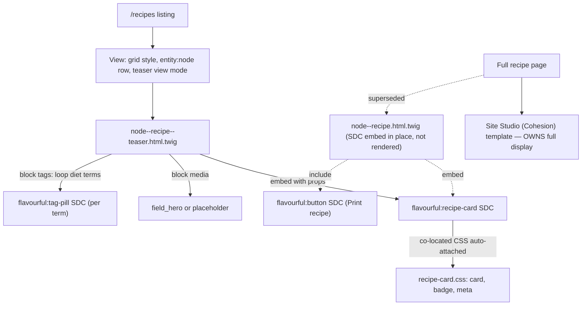

# Build Outcomes — Day 9 (Atomic Design with SDC)

> Branch: `feat/day7-views-config-and-full-export` · Last updated: 2026-07-13
>
> What actually got built when the [Day 9 lab](../objectives/day9-atomic-sdc.md) met the running project. This is the **outcome** companion to the plan — it does not re-teach atoms/molecules, SDC anatomy, or props-vs-slots, nor repeat the component listings already in the objective. It records what shipped, what diverged, and why. Read [Day 9](../objectives/day9-atomic-sdc.md) first, then this. It directly **supersedes** several [Day 8](day8-twig-templates.md) open items (the macro/partial card is replaced by SDCs); sits alongside the cross-cutting [`lessons-learned.md`](lessons-learned.md).
>
> **Status: shipped and verified on the listing.** Three components render live per row on `/recipes` (HTTP 200, 12 cards, no watchdog errors); the button and enum-validation were verified in isolation. The one deviation that matters: the **full** recipe display is owned by Site Studio, so the node-page embed is in place but not what the front end renders (deviation 2).

---

## Objective → outcome map

| Objective | What shipped | Status |
|---|---|---|
| [§3](../objectives/day9-atomic-sdc.md) — `button` atom (all props, no slots) | [`components/button/`](../../docroot/themes/custom/flavourful/components/button/) — `button.component.yml` + `.twig` + `.css`. Renders `<a class="btn btn--primary">`; `variant: 'huge'` throws the enum error. | Done — verified in isolation |
| [§4](../objectives/day9-atomic-sdc.md) — `tag-pill` atom | [`components/tag-pill/`](../../docroot/themes/custom/flavourful/components/tag-pill/) — yml + twig + co-located css (the `.pill` had no styles in Day 8). | Done |
| [§5](../objectives/day9-atomic-sdc.md) — `recipe-card` molecule (props **and** a slot) | [`components/recipe-card/`](../../docroot/themes/custom/flavourful/components/recipe-card/) — typed props + a `tags` slot **and** a `media` slot. | Done — extended past the lab's prop list (deviation 3) |
| [§6](../objectives/day9-atomic-sdc.md) — use the card in the node template | [`content/node--recipe.html.twig`](../../docroot/themes/custom/flavourful/templates/content/node--recipe.html.twig) — embeds `recipe-card`, fills `media`/`tags` slots, adds a `flavourful:button` print action; debug `dump()`s removed. | Deviated — code is correct but Site Studio owns the full display, so it does not render (deviation 2) |
| [§6](../objectives/day9-atomic-sdc.md) — use the card in a Views listing | [`content/node--recipe--teaser.html.twig`](../../docroot/themes/custom/flavourful/templates/content/node--recipe--teaser.html.twig) — the teaser rows of the `/recipes` view now embed `recipe-card`. | Done — **live**, the primary demonstration |
| [§7](../objectives/day9-atomic-sdc.md) — SDC vs Site Studio vs Paragraphs vs Twig | Comparison table + interview lines. Documentation only; no code. | N/A — lives in the objective |

Supporting change: the card/badge styling moved out of the SCSS pipeline into the component (deviation 5), so [`scss/components/_index.scss`](../../docroot/themes/custom/flavourful/scss/components/_index.scss) dropped two `@forward`s and `css/recipes.css` was rebuilt down to listing-layout only. No `docs/objectives/` file was edited this round.

---

## Render paths

One `recipe-card` definition, reached two ways — and the Site Studio fork that changes the story on the full page.



---

## Deltas-only walkthrough

Only what changed against the objective's baseline — the component anatomy and full listings live in [Day 9](../objectives/day9-atomic-sdc.md).

**1. Namespace is the theme machine name, not the lab's `flavorful_theme`.** Every render call is `flavourful:button`, `flavourful:tag-pill`, `flavourful:recipe-card`. This also sidesteps the Day 8 `@flavourful/templates/…` namespace bug entirely — SDC uses the `theme:component` form, which core resolves from the `components/` directory with no `info.yml` wiring.

**2. `recipe-card` reproduces the existing rich teaser, so it took more props than the lab.** The lab's card is `title/url/total_time/difficulty/image_url` + a `tags` slot. To avoid regressing the card the site already had, the shipped component adds `eyebrow` (cuisine) and `summary` props, renames the time prop to `cooking_time`, and — the important change — takes the hero as a **`media` slot** rather than an `image_url` prop. A slot lets the caller pass the *rendered* `field_hero` (preserving image style, alt text and cacheability) or a placeholder, which a plain URL string cannot do. Net: two slots (`media`, `tags`), both exercised.

**3. Props are built defensively before the embed.** Empty field values are the flip side of schema validation — passing `''` to the `difficulty` enum, or `null` to a typed prop, is a hard 500 (see deviation 4). Both node templates therefore assemble props first:

```twig


  


```

`default('')` keeps string props valid; `+ 0` coerces the integer prop; `difficulty` is merged in **only when set** because an enum has no safe empty default. Note the embed omits `only` — the slot blocks read `node`/`content`, which `only` would strip.

**4. Listing wired through the teaser template, not `views-view-unformatted`.** The Day 8 [`views-view-unformatted--recipes.html.twig`](../../docroot/themes/custom/flavourful/templates/views/views-view-unformatted--recipes.html.twig) is dead code: the recipes view uses **grid** style with an **`entity:node`** row in **teaser** view mode, so rows render through `node--recipe--teaser.html.twig`. Putting the embed there is what makes the card appear per row — and is a cleaner "one component, many contexts" than a bespoke row template. The stray unformatted file was left untouched.

**5. The card's CSS is the component, not the SCSS build.** `_recipe-card.scss` and `_badge.scss` were removed from [`scss/components/_index.scss`](../../docroot/themes/custom/flavourful/scss/components/_index.scss) and deleted; their rules (card, difficulty badge, meta) now live in [`recipe-card.css`](../../docroot/themes/custom/flavourful/components/recipe-card/recipe-card.css), auto-attached by SDC wherever the card renders. `.btn` and `.pill` live in their own components. All component CSS consumes the global `--fr-*` tokens from `css/global.css`, so the design system still drives them. `css/recipes.css` now contains only `.recipes-header`/`.recipes-grid`/`.recipes-view` layout.

---

## Deviation log

Where the build departed from the plan, and why. Format matches [`lessons-learned.md`](lessons-learned.md): what happened → why → what we did.

| # | Divergence from objective | Why it happened | What we did / open item |
|---|---|---|---|
| 1 | **Namespace `flavourful:` not the lab's `flavorful_theme:`.** | The theme machine name is `flavourful` (British spelling from the Day 6 rename). | Used `flavourful:<component>` throughout. Bonus: the SDC `theme:component` form avoids the Day 8 `@flavourful/templates/…` bug — no namespace declaration needed. |
| 2 | **The full recipe page does not render the node-template embed.** `/node/46` returns 200 but shows no `recipe-card`/`recipe-full` markup. | The recipe **full** view mode is rendered by a **Site Studio (Cohesion)** content template (`X-Drupal-Cache-Tags: cohesion.templates.node.recipe.full.__default__`), which supersedes `node--recipe.html.twig`. | Kept the SDC embed in `node--recipe.html.twig` — it is the correct, documented fallback and matches §6 — but the **live** demonstration is the listing (teaser), which is theme-controlled. Open item: to show the SDC on the full page, either rebuild that view in Site Studio or disable the Cohesion template for recipe/full. |
| 3 | **`recipe-card` extended beyond the lab's props, and takes the image as a slot.** | Reusing the component on the existing listing meant not losing the eyebrow/summary/meta the site already showed; `field_hero` needs its image style + alt, which an `image_url` string prop drops. | Added `eyebrow`/`summary` props, `cooking_time` (not `total_time`), and a `media` slot for the rendered hero field. The `tags` slot still holds `tag-pill` atoms exactly as the lab prescribes. |
| 4 | **Empty field values 500 the page** until props are guarded. First hit: `[flavourful:recipe-card/difficulty] Does not have a value in the enumeration`. | Schema validation "fails loudly" (the lab's selling point) — but that also means `''`/`null` from an empty field is rejected, not ignored. | Build props defensively: `\|default('')` for strings, `+ 0` for the integer, conditional `merge` for the `difficulty` enum. Documented as the operational cost of typed props. |
| 5 | **Card/badge CSS left the SCSS pipeline for the component.** | SDC best practice is co-located, single-source styles that travel with the markup; keeping duplicates in `recipes.css` would drift. | Deleted `_recipe-card.scss`/`_badge.scss`, moved rules into `recipe-card.css` (tokens preserved), rebuilt `css/recipes.css` (now listing-layout only). `.btn`/`.pill` co-located in their own components. |
| 6 | **Resolves Day 8 open items 4 and (partially) 1.** The three `dump()` calls are gone from `node--recipe.html.twig`; the buggy `@flavourful/templates/…` partial/macro card is no longer referenced by the recipe templates. | Day 9's SDC approach replaces the Day 8 macro/partial card outright. | The Day 8 [`macros/ui.html.twig`](../../docroot/themes/custom/flavourful/templates/macros/ui.html.twig) and [`partials/`](../../docroot/themes/custom/flavourful/templates/partials/) files were **left in place** on purpose — they are the "Twig partials/macros" baseline the §7 comparison contrasts against SDC. They are now unused by the recipe templates. |

---

*Add to this file — or a new `dayN-<topic>.md` — whenever a later day lands, so the objectives and outcomes stay in step.*
