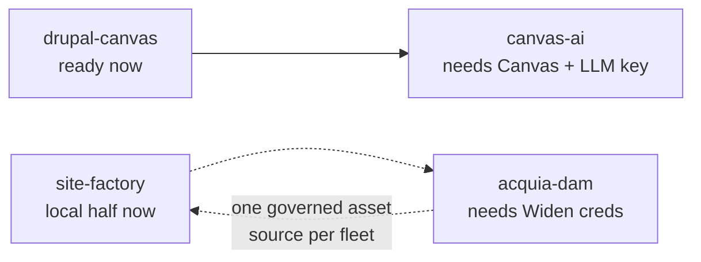

# Future scope

Work that is **scoped but not built** — each file is a task doc, not a lab. These four started as Day 14–17 lab plans; they were reframed here because every one of them is gated on something outside the repo (an Acquia licence, a hosted product, an LLM key) or simply not started yet.

Companion folders: [`../objectives/`](../objectives/) is the preparation guideline and the day-by-day labs that *were* run; [`../actual-outcomes/`](../actual-outcomes/) records what actually shipped.

## Status board

| Task | Status | Blocked on | Rough size |
|---|---|---|---|
| [`drupal-canvas.md`](drupal-canvas.md) — Drupal Canvas + Acquia Nebula | 🟢 Ready | nothing | ~1 day |
| [`site-factory.md`](site-factory.md) — Acquia Site Factory (ACSF) | 🟡 Partly | ACSF can't run locally; local multisite half is buildable | ~half a day + write-up |
| [`acquia-dam.md`](acquia-dam.md) — Acquia DAM (governed assets) | 🔴 Blocked | DAM/Widen account + API creds | ~1 day |
| [`canvas-ai.md`](canvas-ai.md) — Canvas AI Assistant | 🔴 Blocked | a Canvas project + an LLM provider key | ~1 day |

## Suggested order

1. **[`drupal-canvas.md`](drupal-canvas.md)** — the only unblocked item, and the highest-value one: Canvas is the go-forward successor to the Site Studio layer this repo already uses, so it produces a real "how would we migrate?" answer.
2. **[`site-factory.md`](site-factory.md)** local baseline — reuses the existing Day 13 multisite work; ships a concrete "shared code, divergent config" demo even though ACSF itself stays a paper exercise.
3. **[`canvas-ai.md`](canvas-ai.md)** — unlocked as soon as step 1 lands and a key is available.
4. **[`acquia-dam.md`](acquia-dam.md)** — purely credential-gated; the design can be written any time, the build can't.

## What each doc contains

A status line and dependencies, the goal, why it's worth doing, prerequisites as a checklist, tasks as checkboxes, acceptance criteria, any repo-specific constraint (Site Studio owning the recipe full display is the recurring one), a no-access fallback where the item is licence-gated, and sources.
