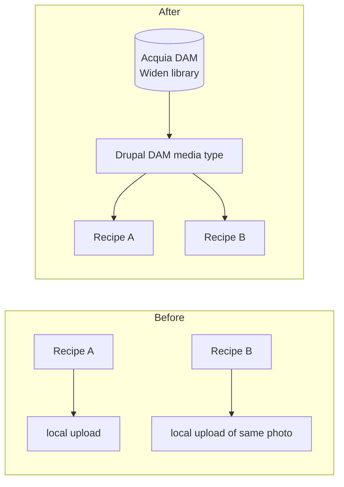

# Future scope — Acquia DAM (governed assets)

| | |
|---|---|
| **Status** | 🔴 Blocked — needs an Acquia DAM (Widen) account + API credentials |
| **Depends on** | Nothing in this repo. Purely an external-access blocker. |
| **Rough size** | ~1 day once credentials exist |
| **Related** | [`../objectives/day1-site-building.md`](../objectives/day1-site-building.md) (media), [`site-factory.md`](site-factory.md) (why DAM matters at fleet scale) |

## Goal

Replace the recipe hero image — currently a local `image` field — with an **Acquia DAM–referenced media asset**, and surface Widen governance metadata (photographer, usage rights, expiry) in Drupal so the recipe page renders *governed* assets rather than re-uploaded copies.

## Why this is worth doing

FoodRecipes dish photos live in local `image` fields. The same hero shot gets re-uploaded per recipe, versions drift, and nothing records which shots are rights-cleared or expired. DAM gives one source of truth for assets with governance attached.

Acquia DAM is built on **Widen**. Drupal references those assets as **remote media entities** via the `acquia_dam` module — no local copy is stored.

## Prerequisites

- [ ] Acquia DAM / Widen account provisioned
- [ ] API token + DAM domain for that account
- [ ] Confirm the correct package name for the target Drupal version (`drupal/acquia_dam` at time of writing — verify against Acquia docs)

## Tasks

**1. Connect DAM**
- [ ] `ddev composer require drupal/acquia_dam` && `ddev drush en acquia_dam -y`
- [ ] Enter API token / domain on the module's config screen
- [ ] Verify a DAM media type appears under **Structure → Media types**
- [ ] Browse the Widen library from **Content → Media → Add media** and confirm selecting an asset creates a *remote* media entity

**2. Swap the recipe image over**
- [ ] Add a **DAM image** field on the Recipe content type — media reference, restricted to the DAM media type
- [ ] Bind it in the display (see the constraint below)
- [ ] Re-point one existing recipe at a DAM asset and confirm it renders

**3. Governance metadata — the actual point**
- [ ] Map Widen metadata into media fields: photographer/credit, usage rights, expiry date, asset version
- [ ] Make expired or unlicensed assets visible (and ideally blockable) in the editorial UI

## Repo-specific constraint

The recipe **full display is owned by Site Studio (Cohesion)** — see [`../actual-outcomes/day4-5-site-studio-nutrition.md`](../actual-outcomes/day4-5-site-studio-nutrition.md). Bind the DAM media in the Site Studio content template; the theme templates only affect the **teaser** view mode.

## Acceptance criteria

- A recipe renders its hero from a DAM-referenced remote media entity, with no local file copy.
- Two recipes can reference the *same* DAM asset.
- An editor can see the asset's rights and expiry without leaving Drupal.

## If it stays blocked

Do it on paper and the write-up still lands:
- Walk Acquia's DAM docs, narrating each screen.
- Model the integration locally with a regular Media type standing in for the DAM type, documenting exactly which fields would be DAM-sourced vs local.
- Record the blocker plainly in the outcome note (same pattern as the Day 4 Site Studio licence gap).

## Trade-off to be able to state

Core Media Library stores files in *this* site. DAM is a cross-site, rights-managed, hosted library — it earns its keep when many sites or teams share assets (which is exactly the [Site Factory](site-factory.md) case). The cost is an external dependency, a licence, and sync/latency considerations.

## Sources

- [Acquia DAM product](https://www.acquia.com/products/marketing-cloud/dam)
- [Acquia DAM documentation](https://docs.acquia.com/acquia-dam)
- [Media in Drupal](https://www.drupal.org/docs/core-modules-and-themes/core-modules/media-module)
