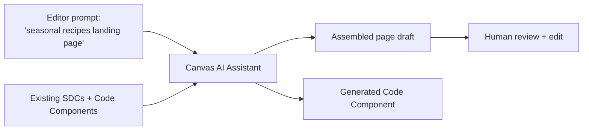

# Future scope — Canvas AI Assistant

| | |
|---|---|
| **Status** | 🔴 Blocked — needs (a) a Canvas project and (b) an LLM provider API key |
| **Depends on** | [`drupal-canvas.md`](drupal-canvas.md) — do that first; this builds directly on it |
| **Rough size** | ~1 day once Canvas is up and a key exists |

## Goal

Use the Canvas AI Assistant to assemble a **recipe landing page** from existing components by prompt, and to **generate a new Code Component** — then evaluate honestly where AI generation helps and where hand-authoring is still required.

## Why this is worth doing

The component library (nutrition card, recipe card, chef sidebar) exists, but assembling a polished landing page — and building the *next* component — is slow manual work. The question is whether an assistant constrained to the real components and their props can produce a usable first draft.

The assistant is grounded in *your* component library and props schema, so it composes pages and scaffolds components from natural language. A draft, not a final.

## Prerequisites

- [ ] A working Canvas project — see [`drupal-canvas.md`](drupal-canvas.md)
- [ ] The Drupal `ai` module plus a provider module installed
- [ ] An LLM provider API key

> **If wiring Anthropic:** use a current model id — `claude-opus-5` is the default choice today (`claude-sonnet-5` for a cheaper/faster tier). Do **not** copy an id from an older tutorial; retired ids return 404.

## Tasks

**1. Enable the assistant**
- [ ] Enable the AI submodule: `ddev drush en canvas_ai -y` (the machine name is `canvas_ai` or `xb_ai_assistant` depending on version — verify against current docs)
- [ ] Configure the LLM provider via the `ai` module and supply the key

**2. Prompt-build a landing page**
- [ ] Open the recipe landing page in Canvas
- [ ] Prompt: *"Build a seasonal recipes landing page: hero, a 3-column grid of recipe cards, and a chef spotlight sidebar."*
- [ ] Observe how intent maps onto the real components and props; correct where it guessed wrong
- [ ] Confirm the generated page uses actual Code Components with correct props — not invented markup

**3. Generate a Code Component**
- [ ] Prompt: *"A cook-time badge: props `minutes` (number) and `level` (easy/medium/hard), colour-coded."*
- [ ] Review the output against the Nebula conventions from the Canvas task: props schema, structure, styling, a11y
- [ ] Edit to production quality — **the review step is the skill being practised**

**4. Evaluate honestly**
- [ ] Where it helps: first-draft assembly, boilerplate scaffolding, exploring layouts fast
- [ ] Where it isn't trusted: accessibility nuance, bespoke interaction/JS, brand-exact styling, edge-case props
- [ ] Governance: AI-generated components still go through PR review and config change-control. AI does not bypass governance.

## Acceptance criteria

- A landing page was assembled by prompt and it references real components with correct props.
- A generated component was reviewed against the repo's conventions and brought to production quality.
- A specific prompt that was run, and the specific correction made to its output, can be described.
- The helps/doesn't-help boundary is stated from experience, not from marketing copy.

## If it stays blocked

Narrate the flow from Acquia's Canvas AI docs, write down the *prompts* that would be used and the *expected* component-grounded output, and record the blocker in the outcome note — same honesty pattern as the Site Studio and DAM licence gaps.

## Sources

- [Drupal Canvas AI Builder (Acquia docs)](https://docs.acquia.com/acquia-source-cms/drupal-canvas-ai-builder)
- [Drupal Canvas FAQ (Acquia)](https://www.acquia.com/blog/drupal-canvas-faq)
- [AI module for Drupal](https://www.drupal.org/project/ai)
- [Claude API — model ids](https://platform.claude.com/docs/en/about-claude/models/overview)
