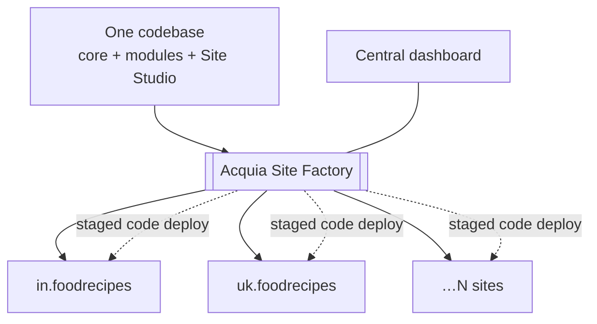

# Future scope — Acquia Site Factory (ACSF)

| | |
|---|---|
| **Status** | 🟡 Partly actionable — the local multisite half can be built now; ACSF itself **cannot run locally** (hosted Acquia product, subscription required) |
| **Depends on** | The Day 13 core-multisite baseline ([`../objectives/day13-multisite-governance.md`](../objectives/day13-multisite-governance.md)) |
| **Rough size** | ~half a day for the local baseline; the ACSF layer is design + vocabulary, not build |
| **Related** | [`acquia-dam.md`](acquia-dam.md) (one governed asset source across a fleet) |

## Goal

Stand up two regional editions locally — `in.foodrecipes` and `uk.foodrecipes` — off one codebase, then write up precisely what ACSF productizes on top: site collections, stacks, staged code deploys, central dashboard.

The contrast **is** the deliverable. DIY multisite is the part you can hold in your hands; ACSF is the fleet-management layer above it.

## Why this is worth doing

FoodRecipes wants regional editions: same recipe engine, different content, branding, and language, centrally updated. Two sites is a `sites.php` exercise. Two hundred sites is a fleet-management problem — that's ACSF.

## Prerequisites

- [ ] Day 13's `sites/sites.php` maps two hostnames to two site directories, each with its own DB + `config/sync`
- [ ] (ACSF layer only) An Acquia Cloud Site Factory subscription — not available in this repo

## Tasks

**1. Local baseline — buildable now**
- [ ] Add DDEV `additional_hostnames` for `in.foodrecipes` / `uk.foodrecipes`, then `ddev restart`
- [ ] Install/verify each site per-URI:
      `ddev drush --uri=https://in.foodrecipes.ddev.site status`
      `ddev drush --uri=https://uk.foodrecipes.ddev.site status`
- [ ] Diverge them via **Config Split** — e.g. the UK edition uses metric units and different featured recipes. This is what proves "shared code, divergent config."
- [ ] Load each hostname and confirm distinct content/config off one codebase

**2. Document the ACSF layer — design only**
- [ ] **Site collections / stacks** — grouping and provisioning many sites; a *stack* is the codebase + infra sites are spun from
- [ ] **Factory-driven provisioning** — new sites from the dashboard/API, no manual `sites.php` editing or DB creation
- [ ] **Staged code deploys** — one branch pushed across the fleet through dev → stage → prod, with the Site Studio sequence (`cim → cohesion:import → cohesion:rebuild`) automated per site
- [ ] **Central governance dashboard** — users/roles, updates, monitoring across all sites
- [ ] **Domain management** — mapping and validating custom domains per site at scale

## Acceptance criteria

- Two hostnames serve visibly different content and config from one codebase locally.
- The write-up can state, without hedging, what ACSF adds over what was built by hand.
- The honest boundary is stated explicitly: core multisite mechanics are hands-on; operating a large ACSF fleet is not.

## The comparison to be able to give

| | Core multisite (local) | Acquia Site Factory |
|---|---|---|
| Provisioning | manual `sites.php` + DB | dashboard/API, self-service |
| Deploys | per-site `drush --uri` | staged fleet-wide pipeline |
| Governance | you build it | central dashboard, roles, updates |
| Scale | tens (discipline-limited) | hundreds+ |
| Cost | code only | Acquia subscription |

## Sources

- [Acquia Cloud Site Factory docs](https://docs.acquia.com/acquia-cloud-site-factory)
- [Multisite (Drupal.org)](https://www.drupal.org/docs/administering-a-drupal-site/multisite-drupal)
- [Config Split](https://www.drupal.org/project/config_split)
