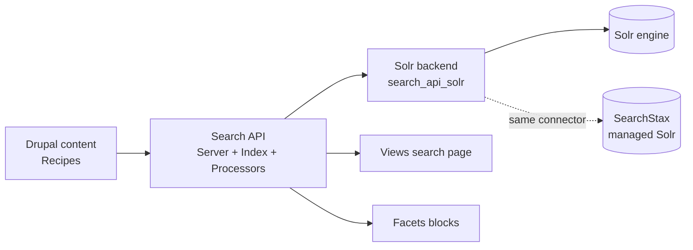

# Flavourful — Day 10 Lab: Search with Search API, Solr & SearchStax

> Companion to the [advanced curriculum](advanced-plan-days6-9.md). This is the highest-value addition for **NMQ specifically**: bank §4 is entirely about search, and NMQ is **migrating Solr → SearchStax**. Good news — SearchStax is *managed Solr* reached through a Search API Solr **connector**, so everything you build here transfers directly.
>
> Uses your real project: theme `flavourful`, module `flavourful_nutrition`, and the real recipe fields (`field_recipe_cuisine_type`, `field_type_of_diet`, `field_recipe_ingredients`, `field_difficulty`, `field_summary`).

**Build target:** a working recipe search — Solr running in DDEV, a Search API **server + index** over recipes, a **search page**, **facets** on cuisine + diet, **field boosts** for relevance — then the **SearchStax connector** swap and the migration talk-track.

---

## 0. The architecture (say this before touching anything)

**🧠 In plain terms:** Drupal doesn't search Solr directly. **Search API** is an abstraction layer; **Solr** is the engine; **SearchStax** is just hosted Solr you point Search API at.



- **Server** = the connection to a backend (Solr / SearchStax).
- **Index** = the searchable copy of your content — you choose which entities and fields go in, and which **processors** transform them (tokenizing, stemming, HTML stripping).
- **Views + Facets** query the index.
- **SearchStax** swaps in at the *server/connector* level only — the index, views and facets don't change. That's why "we're moving to SearchStax" is a low-drama migration.

---

## 1. Run Solr locally (DDEV)

**🔎 Why:** you need a Solr engine to point at. DDEV has an official add-on.

```bash
# from the project root
ddev add-on get ddev/ddev-drupal-solr   # (older DDEV: ddev get ddev/ddev-drupal-solr)
ddev restart
```

- This starts a Solr container. Its admin UI is at the URL DDEV prints (typically `https://<project>.ddev.site:8943/solr` or via `ddev describe`).
- Note the connection values the add-on sets: **host `solr`, port `8983`, core/path** — you'll enter these in step 3.

> 🔎 **Test it:** `ddev describe` lists the Solr service and its URL; open the Solr admin UI and confirm it loads.

---

## 2. Install the search modules

```bash
composer require drupal/search_api drupal/search_api_solr
drush en search_api search_api_solr -y
drush cr
```

- `search_api` = the abstraction layer (core-quality contrib).
- `search_api_solr` = the Solr backend plugin (supports Solr 3.6–9; Drupal 11-ready).

---

## 3. Create the Search API **server** (the Solr connection)

1. Go to **Configuration → Search and metadata → Search API** (`/admin/config/search/search-api`) → **Add server**.
2. **Server name:** `Solr`. **Backend:** select **Solr**.
3. **Solr connector:** **Standard**. Fill in what the DDEV add-on set:
   - **HTTP protocol:** `http`
   - **Solr host:** `solr`
   - **Solr port:** `8983`
   - **Solr path:** `/`
   - **Default Solr core:** the core name the add-on created (see `ddev describe`), e.g. `flavourful`.
4. **Save**. On the server page, the status should show **"The Solr server could be reached."** (If not, re-check host/port from `ddev describe`.)

> 🔎 **Test it:** the server page shows a green "reached" message and the Solr version.

---

## 4. Create the **index** over Recipes

1. Back on the Search API page → **Add index**.
2. **Index name:** `Recipes`. **Data sources:** tick **Content**. **Server:** select **Solr**.
3. **Pick the right bundle — this is where it usually goes wrong.** Under the **Content** datasource's configuration, find **"Which bundles should be indexed?"** → choose **"Only those selected"** → tick **Recipe** (and make sure **Chef** is *un*ticked). *(Or "All except those selected" with nothing ticked = index every bundle.)*

   > ⚠️ **Symptom check:** if the **Add fields** picker (next step) shows only base fields (`nid`, `title`, `created`…) plus a **chef** field like `field_chef_name`, and **none** of the recipe fields — your datasource is indexing the **Chef** bundle, not Recipe. Come back here and fix the bundle selection, then Save.
4. **Save and add fields.** On the index click **Add fields** to open the field picker.

   > ⚠️ **Why you couldn't find some fields — read this first.** In your project, **Cuisine type, Type of diet, and Ingredients are entity-reference fields** (they point at taxonomy terms). The picker does **not** list those at the top level next to Title — you have to **expand the field** to reach the referenced term's properties. **Difficulty** (a list) and **Total time** (a number) *are* top-level, but the picker shows every field by its **human label**, so scroll/filter for "Difficulty" and "Total time", not the machine names.

   **Top-level fields (add directly — use the picker's filter box by label):**
   - **Title** → type **Fulltext**.
   - **Summary** (`field_summary`) → **Fulltext**.
   - **Difficulty** (`field_difficulty`, a list) → **String**.
   - **Total time** (`field_total_time`, integer) → **Integer** (lets you sort/filter).

   **Reference fields (nested — you must drill in).** For **Ingredients**, **Cuisine type**, and **Type of diet**: find the field in the picker and click it to expand — it opens into **» Taxonomy term** (the referenced entity). Then add **two** things per field:
   - the term's **Name** → **Fulltext** (so the label is searchable), and
   - the field's raw **» ID** (the `target_id`) → **String** (this is what the **facet** in §6 uses).

   > 🛠 **Still can't see the recipe fields?** In order of likelihood:
   > 1. **Wrong bundle (most common).** If you see base fields + a **chef** field (`field_chef_name`) but no recipe fields, your datasource is indexing **Chef**, not Recipe — go back to step 3 and fix the bundle, Save, then reopen Add fields.
   > 2. **Reference fields are nested** — Cuisine/Diet/Ingredients don't sit at top level; expand the field to reach "Taxonomy term", then add the term **Name** (Fulltext) and the **» ID** (String).
   > 3. **Confirm the field is on Recipe** at `/admin/structure/types/manage/recipe/fields`.
   > 4. **Use the picker's filter box** and search by label ("Difficulty", "Total time").

5. Rule of thumb for **types**: text you want *searched* = **Fulltext**; values you *facet or sort* on = **String/Integer** (facets need the raw value, not fulltext). **Save**.
6. **Processors** tab — enable the everyday ones: **Ignore case**, **Tokenizer**, **Stemmer** (so "tomatoes" matches "tomato"), **HTML filter** (strip markup from rendered text), **Rendered HTML output** if you want the whole rendered entity searchable. **Save**.
7. **Index now:** go to the index's **View** tab → **Index now** (or `drush search-api:index`). Watch it index your recipes.

> 🔎 **Test it:** the index page shows "100% indexed (N/N)". `drush search-api:status` prints the same from the CLI.

---

## 5. Build the search page (a View on the index)

**🧠 In plain terms:** a normal View, but its "base" is the search **index**, not Content.

1. **Structure → Views → Add view.** **View name:** `Recipe search`. Under **VIEW SETTINGS → Show**, pick **Index Recipes** (your index appears as a data source). Tick **Create a page**, **Path** = `recipe-search`, **Display format** = **Unformatted list** of **Fields** (or Rendered entity). **Save and edit.**
2. **FILTER CRITERIA → Add** → **Fulltext search** → expose it (this is the search box). Set it to search your fulltext fields.
3. **FIELDS** → add Title, cuisine, difficulty, total time (or use Rendered entity rows).
4. **SORT CRITERIA** → add **Relevance** (Search API's score) so best matches rank first; optionally an exposed "Quickest" sort on `field_total_time`.
5. **Save**, visit `/recipe-search`, type an ingredient — results ranked by relevance.

> 🔎 **Test it:** search "tomato" → recipes containing tomato appear, best matches first.

---

## 6. Facets (cuisine + diet)

**🧠 In plain terms:** facets are filter blocks (with counts) built from indexed field values — they add `fq`-style constraints without changing the relevance score.

```bash
composer require drupal/facets
drush en facets facets_range_widget -y
drush cr
```

1. **Configuration → Search and metadata → Facets** (`/admin/config/search/facets`) → **Add facet**.
2. **Source:** your **Recipe search** view (the search display). **Field:** **field_recipe_cuisine_type** (the term-ID field). **Name:** `Cuisine`. Save.
3. On its settings: **Widget** = *List of checkboxes* (or links), tick **Show the amount of results** (counts), and set empty-behavior to hide.
4. **Show labels, not IDs (do this or your checkboxes read `12`, `15`…).** Because the facet is built on the raw **term ID**, it displays IDs by default. In the facet's **Processors** section, tick **"Transform entity ID to label"** → Save → `drush cr`. Now each checkbox shows the term **name** ("Italian", "Vegan"), while still filtering by ID under the hood.

   > 🛠 The facet still *filters* by ID (fast, correct); the processor only changes the *display*. For a `list_string` field like Difficulty, use the **"List item label"** processor instead (shows the option label, not the stored key).

5. Repeat for **field_type_of_diet** → facet `Diet` (enable the same **Transform entity ID to label** processor).
6. **Place the facet blocks:** **Structure → Block layout** → place the **Cuisine** and **Diet** facet blocks in a sidebar region, with **Visibility → Pages** limited to `/recipe-search`.
7. Visit `/recipe-search` → tick "Italian" and "Vegan" → results narrow, counts update, and the URL gains facet query args.

> 🔎 **Test it:** applying a facet narrows results and the count next to each option matches. This is the exact "facets + pagination with Search API" the bank asks about (§4).

---

## 7. Relevance boosts (`q` vs `fq`, field weighting)

**🧠 In plain terms:** make matches in important fields count more.

1. On the **index → Fields**, each Fulltext field has a **Boost** dropdown. Set **Title = 5.0**, **field_summary = 2.0**, ingredients = 1.0. **Save**, then **re-index** (`drush search-api:reindex && drush search-api:index`).
2. Now a title match outranks a body match.

### How you actually used `q` and `fq` (you didn't type them — Search API did)

**The key idea:** you never wrote `q=` or `fq=` by hand. Every choice you made in the UI, Search API **translates into Solr's query parameters** for you. So "how did we use `q` and `fq`?" — like this:

| What you built | What Solr receives | Effect |
|---|---|---|
| The **exposed Fulltext filter** (the search box, step 5) | **`q`** — the main, *scored* query | Decides **relevance / ranking** — which results, in what order |
| Ticking a **facet** (e.g. Cuisine = Italian, §6) | **`fq`** — a *filter* query | **Narrows** results, does **not** change scores; cached separately so it's cheap |
| The **field boosts** you set (`Title = 5.0`, step above) | the field-weighting part of `q` (Solr `qf`, e.g. `title^5`) | Makes title matches rank higher |

**A concrete example.** You open `/recipe-search`, type **`tomato`**, and tick **Italian**. Behind the scenes Search API sends Solr roughly:

```text
q  = tomato                              ← the search box  (scored, ranked)
qf = title^5 field_summary^2 ...         ← your field boosts
fq = field_recipe_cuisine_type:12        ← the "Italian" facet (12 = its term ID; filter only)
```

- Change the **search term** → results and their **order** change (that's `q` + scoring).
- Tick/untick a **facet** → the set **narrows/widens** but the ranking of what remains is unchanged (that's `fq`).

That difference — *`q` ranks, `fq` filters* — is exactly what bank §4 is testing.

> 🔎 **See it for yourself (two ways):**
> 1. **Feel the difference in the UI:** search a term that's in one recipe's **title** and another's **body** → the title one ranks higher (that's `q` + boosts). Then apply a facet → the list just shrinks, order of the survivors doesn't jump around (that's `fq`).
> 2. **See the raw Solr query:** open the **Solr admin → your core → Query** panel (from step 1) and run a query with `q=tomato` and `fq=field_recipe_cuisine_type:12` yourself — you'll watch `q` affect the score column while `fq` only filters. (To see exactly what Drupal sends, enable request logging on the Search API Solr server, or check Solr's `solr.log`.)

---

## 8. SearchStax — the migration (the NMQ headline)

**🧠 In plain terms:** SearchStax is **managed Solr**. You don't rebuild anything — you add its **connector** and repoint the server.

```bash
composer require drupal/search_api_searchstax
drush en search_api_searchstax -y
drush cr
```

1. In SearchStax (their cloud console) create a Search API app and copy its **endpoint + credentials/API key**.
2. Edit your Search API **server** (`/admin/config/search/search-api` → Solr → Edit). Change the **Solr connector** to the **SearchStax** connector (it's a `search_api_solr` connector plugin), and paste the SearchStax endpoint/key. **Save**.
3. **Re-index** (`drush search-api:reindex && drush search-api:index`).
4. Your **index, views, facets and boosts are unchanged** — only the backend moved.

**Say this in the interview (honest + informed):**

> "SearchStax is managed Solr exposed through a Search API Solr connector — the `search_api_searchstax` module. Migrating from self-hosted Solr is mostly repointing the server's connector to SearchStax's endpoint and re-indexing; the index config, Views and Facets don't change. On top of the hosting, SearchStax adds a Site Search UI with analytics and relevance tuning for business users. So my Search API/Solr knowledge transfers directly — the migration is low-risk config, not a rebuild."

> 🙋 **Honesty:** "I've built Search API + Solr + Facets hands-on; I haven't run SearchStax in production, but because it's the same Solr underneath I'd be productive on day one."

---

## 9. End-of-day verification (say these out loud)

1. The stack: **Search API (abstraction) → Solr (engine) → SearchStax (managed Solr)**.
2. **Server vs index vs processor** — what each does.
3. **`q` vs `fq`**, and how the search box maps to `q` while facets map to `fq`.
4. How **boosts** tune relevance.
5. How **facets** are built and placed (source = the search view; field = a raw indexed value).
6. The **SearchStax migration** = swap the connector, re-index; everything else stays.

## Interview Q&A

| Question | Answer shape |
|---|---|
| "Search API vs Solr?" | Search API = Drupal abstraction (server/index/fields/processors); Solr = the engine it talks to. |
| "`fq` vs `q`?" | `q` = scored main query (the search box); `fq` = non-scored filter, cached (facets). |
| "Boosts?" | Per-field weight on the index (`title^5`) so important fields rank higher. |
| "Facets + pagination?" | Facets module on the index → filter blocks with counts; pager on the search view. |
| "SearchStax?" | Managed Solr via a Search API Solr connector; migration = repoint server + re-index; index/views/facets unchanged. |

---

### Sources

- [Search API Solr (Drupal.org)](https://www.drupal.org/project/search_api_solr) · [Facets (Drupal.org)](https://www.drupal.org/project/facets)
- [SearchStax Search API module (Drupal.org)](https://www.drupal.org/project/search_api_searchstax) · [SearchStax Managed Search for Drupal](https://www.searchstax.com/docs/managed-search-for-drupal-11/)
- [DDEV Drupal Solr add-on](https://github.com/ddev/ddev-drupal-solr)
