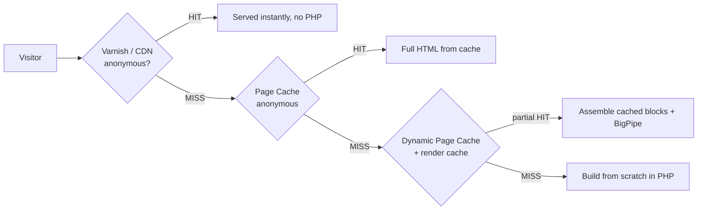
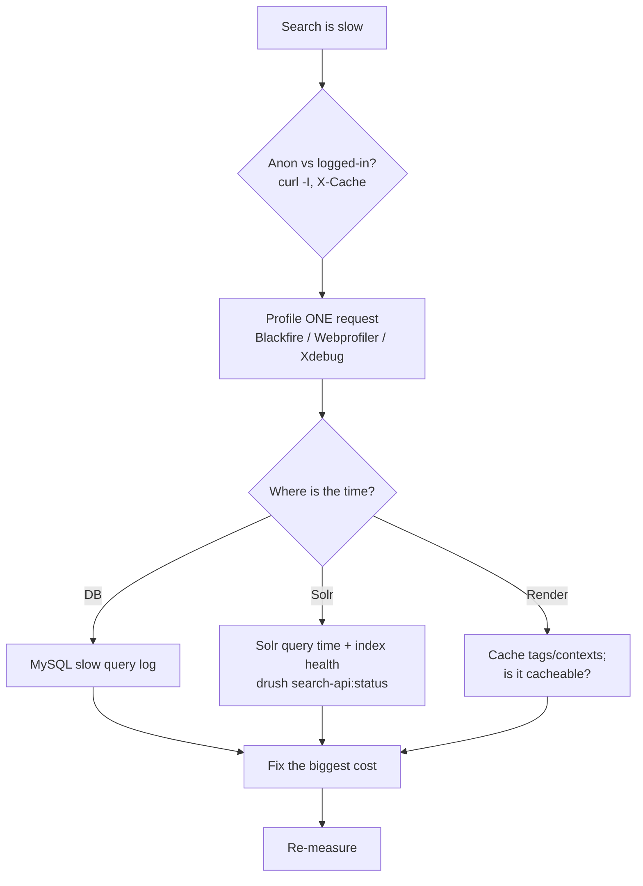

# Flavourful — Day 11 Lab: Performance, Caching & the Debugging Method

> Companion to the [advanced curriculum](advanced-plan-days6-9.md). Bank §3 (Performance & Caching) is heavily weighted and only scattered across earlier days. It explicitly tests **systematic debugging** ("a search feature is loading slowly — how do you diagnose it?"). This day makes you fluent and gives you a repeatable method.
>
> Uses your real project: theme `flavourful`, module `flavourful_nutrition`, field `field_hero` (recipe image).

**Build target:** correct caching on your custom nutrition block, image + asset optimization on the recipe page, and a rehearsed, tool-backed method for diagnosing the slow recipe search from Day 10.

---

## 0. The mental model: caching happens in layers

**🧠 In plain terms:** a request passes through several caches; the goal is to serve as far "left" as possible.



- **Varnish / CDN** — in front of Drupal (Acquia); serves anonymous traffic without touching PHP.
- **Internal Page Cache** — full-HTML cache for anonymous users (core module).
- **Dynamic Page Cache** — caches pages for *all* users, with personalised parts left as placeholders.
- **Render cache + BigPipe** — caches individual render arrays; BigPipe streams slow/personalised parts after the fast shell.
- **The rule:** correct **cache metadata** (tags/contexts/max-age) is what lets every layer cache safely.

---

## 1. Turn the caches on (and know why local is different)

1. **Extend** (`/admin/modules`): confirm **Internal Page Cache**, **Dynamic Page Cache**, and **BigPipe** are enabled (they are by default).
2. **Configuration → Development → Performance** (`/admin/config/development/performance`):
   - **Browser & proxy cache max-age**: set a sensible TTL for anonymous (e.g. 10 min) on stage/prod.
   - **Aggregate CSS** + **Aggregate JS**: **on** for stage/prod.
3. **Locally** keep aggregation **off** and Twig debug **on** (readable output). This on/off split is a Config-Split use case (Day 3).

> 🔎 **Test it:** `curl -I https://<site>/` and look for `X-Drupal-Cache: HIT/MISS` (page cache) — a second anonymous request should be HIT.

---

## 2. Cache metadata done right (recap + verify on your block)

**🧠 In plain terms:** three pieces of metadata make caching *correct*:

- **Tags** — *what it depends on* (`node:42`); changing that data invalidates it everywhere.
- **Contexts** — *what it varies by* (`user`, `url`, `user.permissions`); a variant is cached per value.
- **Max-age** — *how long* it's valid; most Drupal caching leans on tags, not time.

Your `NutritionFactsBlock` (Day 5/9) already does this correctly — verify it:

```php
return [
  '#theme' => 'item_list',
  '#items' => $items,
  // Rebuilds when THIS recipe changes — not on every request.
  '#cache' => ['tags' => $node->getCacheTags()],
];
```

> 🔎 **Test it (user-facing):** open a recipe, note the nutrition. Edit + save that recipe → reload → the block reflects the change (its tag was invalidated). Edit a *different* recipe → this block does **not** rebuild. That's tags working.

---

## 3. Cache invalidation for custom components (bank §3)

When a component pulls **external** data (your Open Food Facts calls), cache the fetch with a TTL, and invalidate explicitly if needed:

```php
// Cache external data for 24h (already in NutritionClient):
$this->cache->set($cid, $result, time() + 86400);

// Force-invalidate a set of tags after a change (e.g. an admin "refresh" action):
\Drupal::service('cache_tags.invalidator')->invalidateTags(['flavourful_nutrition:tomato']);
```

- **Anti-pattern:** `max-age: 0` everywhere = giving up on caching. Declare dependencies instead.

---

## 4. Varnish behaviour (ties to Day 3)

- On Acquia, Varnish caches anonymous responses; watch `X-Cache: HIT/MISS` and `Age` with `curl -I`.
- **The gotcha you already hit:** a page cached *while broken* (e.g. a 404) stays cached — purge it: `acli api:environments:domains-clear-varnish <ENV_ID> <DOMAIN>`.
- Drupal's **Purge** + cache-tags integration lets tag invalidations reach Varnish so edits clear the right entries.

---

## 5. Asset optimization (front-end performance)

1. **CSS/JS aggregation** (step 1) bundles + minifies; libraries load only what a page needs.
2. **Lazy-load** below-the-fold images (`loading="lazy"` — core adds this to many images automatically).
3. Reduce render-blocking assets; put non-critical JS in the footer / defer.
4. For a heavier theme build, add a bundler (Vite/Webpack/Gulp) — but only if the project needs it.

---

## 6. Image optimization: styles, responsive, WebP (bank §3)

Your recipe hero is `field_hero`. Make it fast:

1. **Image styles** — **Configuration → Media → Image styles** (`/admin/config/media/image-styles`): create `recipe_hero_800` (Scale and crop 800×450) and a smaller `recipe_hero_400`.
2. **Responsive image style** — enable core **Responsive Image**, then **Add responsive image style** mapping `recipe_hero_400`/`_800` to breakpoints; set it as the formatter for `field_hero` on the recipe's **Manage display**. Drupal now emits `<picture>`/`srcset` so phones get the small image.
3. **WebP** — Drupal core can create WebP derivatives; add a **"Convert" image-style effect to WebP** (or use a toolkit/module), with JPEG/PNG fallback.

> 🔎 **Test it:** open a recipe on a narrow viewport in DevTools → Network → the hero downloads the small/WebP derivative, not the original.

---

## 7. The debugging method — "the recipe search is slow" (bank §3 ⭐)

**🧠 In plain terms:** don't guess. Localise the cost, fix the biggest one, re-measure.



**The steps, spelled out:**

1. **Reproduce & split anon vs authenticated** — `curl -I` the search URL; if anon is fast but logged-in is slow, it's a caching/context issue, not the query.
2. **Profile one request** — **Blackfire** gives a call-graph of where time goes (or Xdebug profiler, or the **Webprofiler** submodule of Devel).
3. **If the DB is hot** — enable the **MySQL slow query log** and read the offending query.
4. **If it's Solr** — compare Solr's reported query time vs Drupal time; check the index is built and healthy (`drush search-api:status`); make sure filters use `fq` (facets) not `q`.
5. **If it's render** — is the result cacheable? Add proper cache tags/contexts so repeat searches are cheap.
6. **Fix the dominant cost, then re-measure** — never "optimise" blind.

**Tool setup:**

```bash
composer require --dev drupal/devel
drush en devel devel_generate webprofiler -y   # Webprofiler = a request timeline toolbar
```

> **Interview gold:** deliver the flow above as a *method*, not a list of tricks. "I reproduce, split anon vs authenticated to rule caching in or out, profile one request with Blackfire to localise the cost to Drupal, the DB, or Solr, fix the biggest contributor, and re-measure."

---

## 8. End-of-day verification (say these out loud)

1. The caching **layers** (Varnish → Page Cache → Dynamic Page Cache → render cache/BigPipe).
2. Cache **tags/contexts/max-age** — what each answers — with your nutrition-block example.
3. How you'd optimize **images** (styles → responsive → WebP) and **assets** (aggregation).
4. The **debugging method** for a slow feature, naming the tools (Blackfire, slow query log, `search-api:status`).
5. Why `max-age: 0` everywhere is an anti-pattern.

## Interview Q&A

| Question | Answer shape |
|---|---|
| "Approach to performance?" | Measure first; work the layers (cache → assets → images → infra → backend); fix biggest cost, re-measure. |
| "Cache tags vs contexts vs max-age?" | Depends-on / varies-by / how-long. Tags drive invalidation. |
| "Varnish?" | Reverse-proxy cache for anonymous traffic; watch X-Cache/Age; purge stale entries; tags reach it via Purge. |
| "Search is slow — diagnose?" | Reproduce → split anon/auth → profile (Blackfire) → localise DB/Solr/render → fix → re-measure. |
| "WebP / responsive images?" | Image styles + responsive image style (`<picture>`/`srcset`) + a WebP effect with fallback. |

---

### Sources

- [Cacheability of render arrays (Drupal.org)](https://www.drupal.org/docs/develop/drupal-apis/cache-api/cacheability-of-render-arrays)
- [Responsive images (Drupal.org)](https://www.drupal.org/docs/develop/theming-drupal/adding-responsive-images-to-your-theme)
- [Devel / Webprofiler (Drupal.org)](https://www.drupal.org/project/devel)
