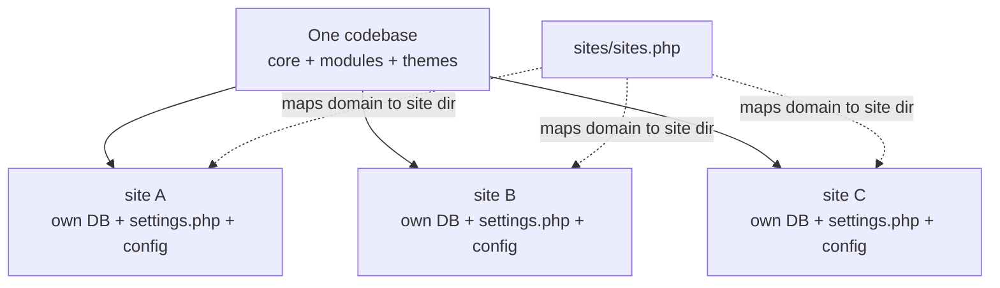

# Flavourful — Day 13 Lab: Multisite & CMS Governance

> Companion to the [advanced curriculum](advanced-plan-days6-9.md). Closes the last bank §1 gap (**"How do you set up a multisite?"**) and the JD's **"CMS governance"** line. Multisite is more config-and-concept than code, so this day is lighter — but knowing the mechanics cold is a clear signal.

**Build target:** understand and (locally) wire Drupal multisite — `sites.php` mapping, per-site settings + database, per-site config — plus a working vocabulary for **governance** (content moderation, roles, config change-control).

---

## 1. What multisite is (and isn't)

**🧠 In plain terms:** *one codebase, many sites* — each with its own database and config, sharing the same Drupal core + modules + themes.



- **Not** the same as one site with multiple languages, or a multi-page site. It's genuinely separate sites off shared code.
- **Trade-off:** cheaper to maintain code once; but a bad module update hits every site, and per-site differences need discipline.

---

## 2. The mechanics — `sites/sites.php`

**🧠 In plain terms:** `sites.php` tells Drupal which folder under `sites/` to use for an incoming domain.

1. Copy the example: `cp sites/example.sites.php sites/sites.php`.
2. Map domains to site directories:

📄 **File:** `docroot/sites/sites.php`

```php
$sites['recipes.example.com'] = 'recipes';
$sites['chefs.example.com']   = 'chefs';
```

3. Create the matching directories, each with its own settings:

```
docroot/sites/
├── sites.php
├── default/            # the fallback site
├── recipes/
│   └── settings.php     # its own DB credentials + config_sync_directory
└── chefs/
    └── settings.php
```

4. Each `settings.php` points at **its own database** and **its own** `config_sync_directory`. Install each site with Drush against its URI:

```bash
drush --uri=https://recipes.example.com site:install --existing-config
drush --uri=https://chefs.example.com   site:install
```

> 🔎 **Test it (local, DDEV):** add the extra hostnames in `.ddev/config.yaml` (`additional_hostnames`), `ddev restart`, add the `sites.php` entries, and load each hostname — each resolves to its own site directory/DB.

---

## 3. Config across sites

- Each site has its **own `config/sync`** — they don't share structural config automatically.
- **Config Split** (Day 3) manages **shared vs per-site** config: a common split for everything shared, per-site splits for the differences.
- Deploying is per-site: `drush --uri=… cim` for each.

> **Interview line:** "Multisite shares code, not content or config. Each site has its own DB and `config/sync`; I use Config Split to keep shared config DRY while letting each site diverge where it must."

---

## 4. At scale: Acquia Cloud Site Factory (ACSF)

- **ACSF** runs and manages *many* sites from one codebase on Acquia — provisioning, updates, and a central dashboard.
- It's the enterprise answer when "multisite" means hundreds of sites (a common NMQ-scale scenario).
- 🙋 **Honesty:** "I understand core multisite mechanics and what ACSF adds on top; I haven't operated a large ACSF fleet, but I know the model."

---

## 5. CMS governance (the JD's word)

**🧠 In plain terms:** the rules and tooling that keep a shared platform safe, consistent, and reviewable.

- **Editorial workflow** — core **Workflows + Content Moderation**: states like *Draft → Needs review → Published*, so editors can't publish unreviewed content.

  ```bash
  drush en workflows content_moderation -y
  ```
  Then at `/admin/config/workflow/workflows` add an *Editorial* workflow, enable it for the **Recipe** type, and set who can transition states via permissions.
- **Roles & least privilege** — Editor/Chef/Admin with only the permissions they need (Day 1); no editor gets `administer …`.
- **Config change-control** — structural changes go through `cex` → PR review of the YAML diff → `cim` on deploy (Days 3). Production is never click-configured.
- **Update & security policy** — `composer audit`, apply security releases promptly, test on stage first.
- **Standards** — accessibility (WCAG), SEO, and performance budgets as part of "definition of done" (Days 5, 11).

> 🔎 **Test it:** enable the Editorial workflow on Recipe, create a recipe as a non-admin → it saves as **Draft** and isn't public until moderated to **Published**.

---

## 6. End-of-day verification (say these out loud)

1. What multisite is: **one codebase, many sites**, each with its own DB + settings + config.
2. The role of **`sites/sites.php`** (domain → site directory mapping).
3. How config is kept **shared vs per-site** (per-site `config/sync` + Config Split).
4. What **ACSF** adds for scale.
5. **Governance**: content moderation workflow, least-privilege roles, config change-control, update policy.

## Interview Q&A

| Question | Answer shape |
|---|---|
| "How do you set up a multisite?" | `sites.php` maps domains to site dirs; each dir has its own `settings.php` + DB; shared codebase; install per-URI. |
| "Config across sites?" | Per-site `config/sync`; Config Split for shared vs per-site; deploy per-site with `--uri`. |
| "Multisite at scale?" | Acquia Cloud Site Factory (ACSF) manages many sites from one codebase. |
| "CMS governance?" | Content Moderation workflow, least-privilege roles, config-in-Git with PR review, security-update policy, a11y/SEO standards. |

---

### Sources

- [Multisite (Drupal.org)](https://www.drupal.org/docs/administering-a-drupal-site/multisite-drupal)
- [Content Moderation (Drupal.org)](https://www.drupal.org/docs/administering-a-drupal-site/content-moderation)
- [Acquia Cloud Site Factory (Acquia docs)](https://docs.acquia.com/acquia-cloud-site-factory)
